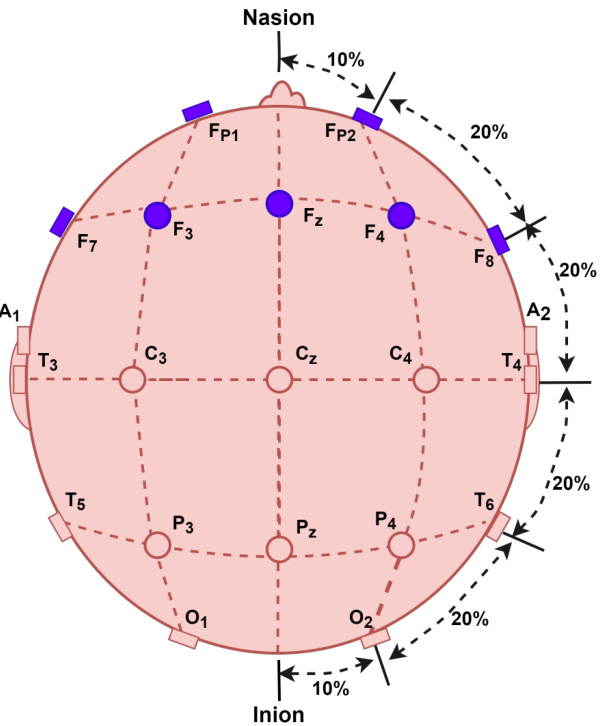
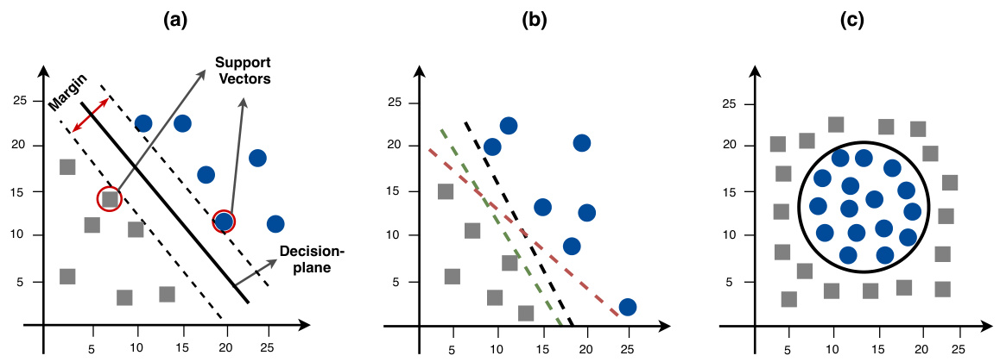
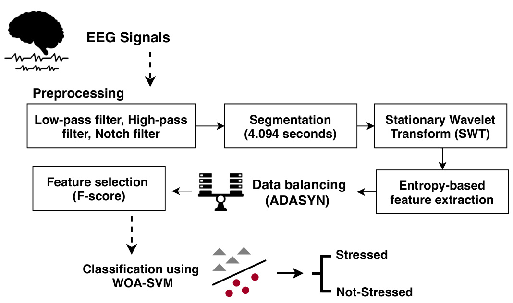
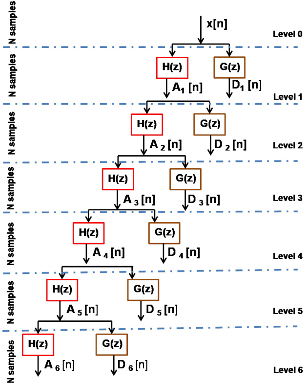
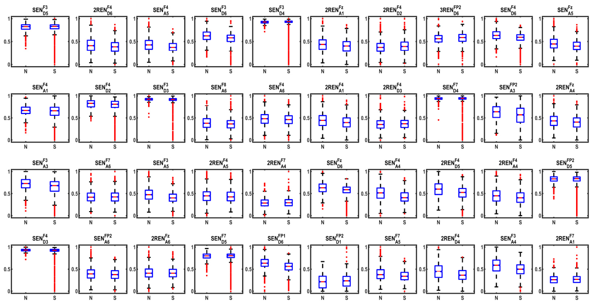
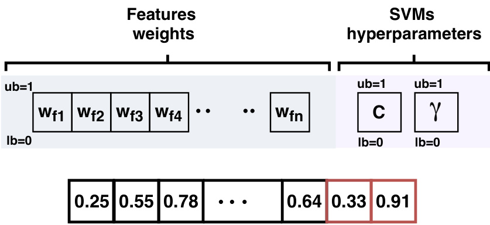
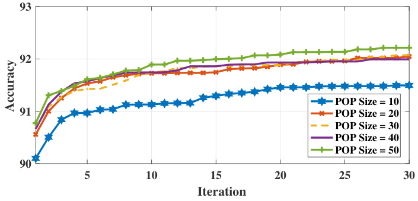
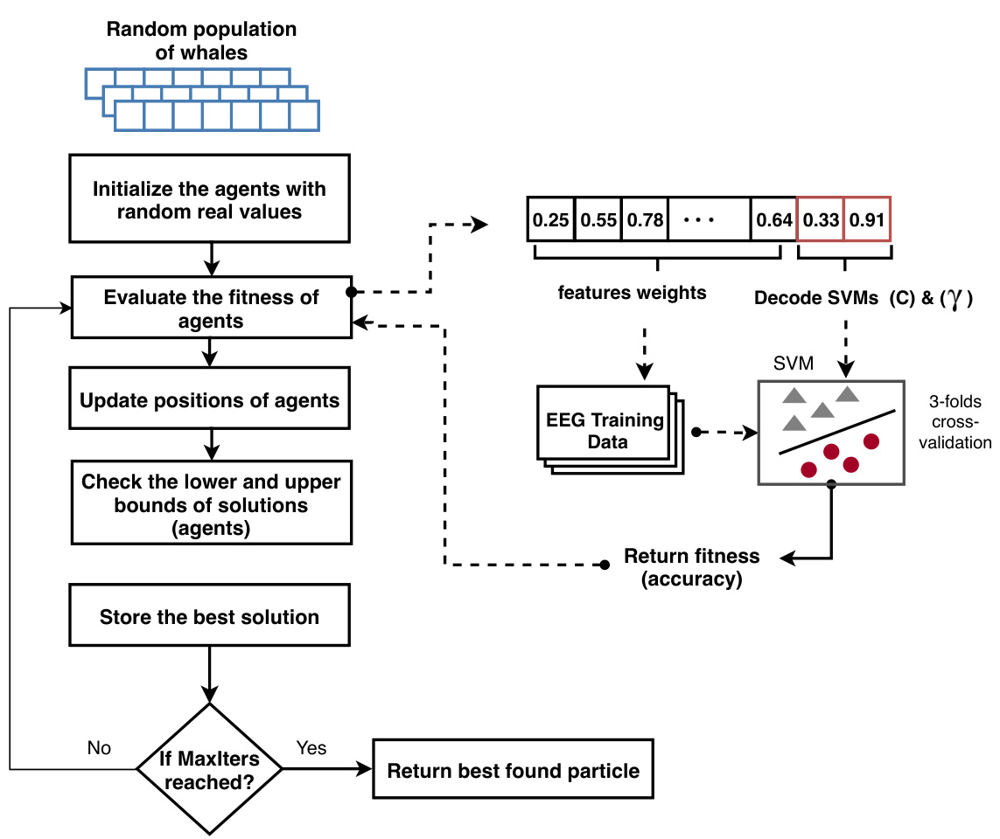
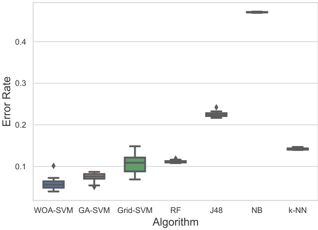

# Evolutionary Inspired Approach for Mental Stress Detection using EEG Signal  

Lakhan Dev Sharma1 devsharmalakhan@gmail.com Vijay Kumar Bohat $^2$ vijay.bohat@gmail.com Maria Habib $^3$ , Ala’ M. Al-Zoubi4 5, Hossam Faris $^{3,4}$ ,6 ,7, Ibrahim Aljarah $^4$ maria.habib@altibbi.com, ala.m.zoubi@gmail.com, hossam.faris@ju.edu.jo,i.aljarah@ju.edu.jo,  

1 School of Electronics Engineering, VIT-AP University, India $^2$ Department of Computer Science & Engineering, Netaji Subhas University of Technology, Delhi, India $^{3}$ Altibbi (https://altibbi.com), Amman, Jordan. 4Information Technology Department, The University of Jordan. Amman, Jordan.  

5School of Science, Technology and Engineering, University of Granada, Granada, Spain 6School of Computing and Informatics, Al Hussein Technical University, Amman, Jordan, $^7$ Research Centre for Information and Communications Technologies of the University of Granada (CITIC-UGR), University of Granada, Granada, Spain  

# Abstract  

Stress is a pensive issue in our competitive world and it has a huge impact on physical and mental health. Severe health issues may arise due to long exposure of stress. Hence, its timed detection can be helpful in managing stress periods. In this regard, electroencephalogram (EEG) based techniques have been widely explored, as stress severely impact the functioning and structure of brain. These non-invasive methods for stress detection need improvement in terms of predictive accuracy and reliability. In this work, a novel approach for stress detection has been presented using short duration of EEG signal. Entropy based features were extracted from EEG signal decomposed using stationary wavelet transform. Selected features were used for classification using different supervised machine learning algorithms. Further, different evolutionary inspired approaches were deployed to optimize the parameters of support vector machines (SVM) and perform feature weighting, simultaneously. SVM optimized using whale optimization algorithm resulted in an accuracy of $97.2559\%$ . Accurate detection using short duration EEG signal shows potential of this technique for timed and reliable detection of stress.  

Keywords: Mental stress, Electroencephalogram, Stationary Wavelet Transform, Evolutionary Inspired, Whale Optimization Algorithm, Support Vector Machine.  

# 1. Introduction  

# 1.1. Motivation  

Stress in general terms has been perceived as a state, where an individual feel troubled and attempts to meet the social and psychological demands. These demands can arise due to change in financial, relationship, work and other similar conditions in which an individual feels pressurized. Among work related medical issues in Europe stress is the second most cause (Alberdi et al. (2016)), after musculoskeletal issue which in some cases can be related to stress (Alberdi et al. (2016); Colligan & Higgins (2006)). $89\%$ Indians and and $86~\%$ in the world, people experience stress but most of them hesitate in taking medical consultation. Stress triggers a natural response, when one experiences a significant challenge or risk. This results in secretion of hormones from our body in its reaction. All the times stress is not a serious or negative condition. It may be positive (“eustress”), complying us to be prepared and cautious against risk. This can improve our performance during work. However, in certain circumstances regular exposure of stress may be life threatening (Ranabir & Reetu (2011)). Stress gets negative (“distress”) in the situations when one faces continuous adversity without relief or help (Selye (1956)). In such situations, an individual get exhausted and stress-related pressure or emotion may influences their way of life (Sharma et al. (2021a); Sharma & Bhattacharyya (2021)). This increases the probability of disturbance in body’s equilibrium or internal balance, leading to physical symptoms like an upset stomach, headaches, chest pain, elevated blood pressure, sleeping problems, sexual dysfunction, respiratory failure, stroke, heart attack, and depression (Duman (2014); EspinosaGarcia et al. (2017)). Hence, automated stress detection techniques can be helpful in improving human life and they can also be relevant to applications like recommendations systems and brain computer interface (Gaur et al. (2015, 2018, 2019a,b)).  

Traditionally, subjective methods like interviews and questionnaires are used for assessing stress (Sharma & Gedeon (2012)). On the other hand, stress-related physical and physiological changes have also been used as objective marker or precursor of stress. For example, physically stress causes variation in blink rate, facial gesture, pupil dilation (Subhani et al. (2017); Gowrisankaran et al. (2012); Deschenes et al. (2015)). The physiological reaction of stress would be at first reflected on the autonomic nervous system. The balance between parasympathetic and sympathetic branches may get break due to exposure of stress events. Sympathetic branch would be hyper-initiated, while parasympathetic branch would be suppressed. This imbalance causes physiological changes and can get reflected while recording the bio-signals of human body.  

# 1.2. Related Work  

Apart from effecting brain and nervous system stress can bring changes in heart rate variability (HRV), respiration, blood pressure, and skin conductance (Wielgosz et al. (2016); Paiva et al. (2016); He et al. (2019); Healey & Picard (2005)). Researchers have proposed various techniques for stress detection using bio-signals like: electrocardiogram (ECG), Galvanic Skin Response (GSR), and electroencephalography (EEG).  

The sinoatrial node (SAN) which is situated in the wall of the right atrium, fires the electrical impulses, controlled by central and autonomous nervous system (ANS). The physiological reaction of stress would be at first reflected on the ANS. The balance between parasympathetic and sympathetic branches may get break due to exposure of stress events (Regula et al. (2014)). Sympathetic branch would be hyper-initiated, while parasympathetic branch would be suppressed (Regula et al. (2014)). These data would be transmitted to the cardiovascular movement, which could be estimated by ECG signals. Using this idea many researchers have utilized ECG and HRV for automated stress detection (Andersson (2017)). Elgendi & Menon (2020) experimented using ECG, EMG, GSR, heart rate and respiration and have concluded that ECG is the optimal bio-signal for a driving stress assessment and have reported an overall accuracy of $75.02\%$ using ECG signal. He et al. (2019) have proposed a system for real-time detection of stress utilizing a convolutional neural network (CNN). Due to the benefit of CNN in programmed feature learning, this system exact and identify stress from HRV signal. They have utilized short time window (10 s) for identification of stress and have achieved a detection error rate of $17.3~\%$ . Munla et al. (2015) have used ECG signal of the driver to extract HRV based features. For classification, Several attributes were extracted after HRV analysis. Results indicate that using SVM-RBF classifier stress could be detected with an accuracy of 83.00 $\%$ .  

GSR is a strategy to quantify the electrical conductance of the skin as it fluctuates with change ambiance around a person. At the point when an individual is stimulated or energized, the moisture levels in the skin fluctuates hence its electrical conductance changes. This is because of the reason that sweat glands are commanded by the sympathetic nervous system. So as to quantify the electrical resistance, a consistent voltage should be applied and the skin conductance can be determined with the use of Ohm’s Law. A GSR Amplifier applies a little voltage through the skin which can’t be felt by people, yet can be recognized after amplification. Many researchers have used GSR signal for developing technique for stress detection. Dehzangi et al. (2019) have proposed GSR-based distracted driving recognition utilizing continuous and discrete decomposition and wavelet packet transform. They utilize two deconvolution strategies to break down raw signal into the phasic and tonic parts. Result shows that it has a accuracy of $92.2~\%$ using ensemble bagged classifier on 74 dimension attribute space. Kurniawan et al. (2013) have proposed a technique for stress detection using GSR and speech signal. They investigated different methods for estimating stress using four classifiers: K-means, SVM, GMM and decision tree. Using speech attributes only, SVM outperformed other classifiers reaching $92\%$ accuracy. Accuracy of classifier trained on GSR based attributes was less. Villarejo et al. (2012) have planned and assembled a pressure sensor dependent on GSR and commanded by ZigBee. It was tried on 16 grown-ups and was discovered that GSR can distinguish the various conditions of every client with an accuracy of $76.56\%$ .  

As indicated by the most recent neuroscience, the human brain is responsible in deciding if a circumstance is undermining and distressing, this makes it prime target of mental stress (Dedovic et al. (2005); Sharma et al. (2021b)). Neurological studies have proved that mental stress effects the brain dynamics and these changes are reflected in EEG signal recorded from cerebral cortex (Yaribey et al. (2017); Lin et al. (2017)). Many models have been created by researchers for stress detection and evaluation utilizing EEG signals, which decide the stress level depending on the cerebrum movement. Jebelli et al. (2018) have proposed a method for identification of stress among workers at building site utilizing EEG signal. Frequency and time based attributes from EEG signal were determined utilizing fixed and sliding windowing approaches. At last, authors applied few supervised learning methods to perceive worker’s stress while they are working at site. The outcomes demonstrated that the fixed windowing approach and the Gaussian SVM yielded the most elevated accuracy of $80.32\%$ .Garcia-Martinez et al. (2017, 2016) have used entropy based features, decision tree and SVM for classification. Vanitha & Krishnan (2016) have proposed a technique for stress detection using EEG signal, which uses Hilbert Huang Transform (HHT) for relevant attribute identification in time-frequency domain. SVM was used as a classifier and they have achieved an accuracy of $89.07~\%$ . Xin et al. (2016) have proposed a procedure for stress state assessment by an Improved SVM. This improved technique increases the accuracy from $73.79\%$ to $81.38~\%$ and decreases the running time from 1973.1 to 540.2 sec. Al-Shargie et al. (2015) have proposed a technique for mental stress quantification using EEG signal. They have used wavelet transform for time-frequency decomposition of the signal. The mean absolute values of the wavelet coefficient in every sub-band and the average of energy and power were calculated. With the help of SVM, they have achieved a maximum accuracy of $94~\%$ . Hou et al. (2015) have proposed a technique using SVM as a classifier, fractal dimension and statistical features. Using their technique two levels of stress can be recognized with an accuracy of $85.71\%$ . Based on the literature survey it can be concluded that a technique based on non-invasive brain signals like EEG can be the most suited method to analyze functional changes aroused due to stress in the brain. An automation in this field of stress detection can be helpful in timed and accurate detection of stressed conditions. This paper presents a stress detection technique using entropy based features extracted from wavelet decomposed short duration EEG signal. Nature inspired optimization algorithm has capability to find optimal values of parameters of various classifiers (Bohat $\&$ Arya (2018)). Recently introduced Whale optimization algorithm (WOA) by Mirjalili $\&$ Lewis (2016) have shown good performance in solving real world optimization problems (Bohat & Arya (2019)). In this study, WOA is deployed to optimize the parameters of support vector machines (SVM) and performs feature weighting simultaneously to develop a reliable and accurate method for stress detection.  

This manuscript is structured as: Section 2 discusses the database used in this research work. Section 3 covers background knowledge of SVM and WOA. Section 4 covers the underlying methodology for the proposed technique. Experiments and results are discussed in section 5 and discussions in section 6. Finally, paper is concluded in section 7.  

# 2. Database  

This section discusses the database used for this research work and protocol adopted during signal recording. EEG during mental arithmetic tasks database has been used in this research work (Zyma et al. (2019); Goldberger AL et al. (2000)). This data is from 36 healthy volunteer aged between 18 to 26 years. Subjects of this publicly available database were having normal color vision and had no learning or mental disabilities. Subjects with alcohol or drug addiction, psychoactive medication and neurological or psychiatric issues were excluded from this database. EEG signals were recorded from the subjects during and before performance of mental arithmetic tasks (performing mental serial subtraction), as per international 10-20 system. We have used recordings from frontal and anterior frontal lobe of brain (Fp1, Fp2, F3, F4, F7, F8 and Fz) in our research work. Since, frontal lobe contains most of the dopamine neurons in the cerebral cortex which is associated with decision-making, short-term memory tasks, attention and planing. A 10-20 EEG electrode placement is depicted in Figure 1. To remove artifacts, powerline notch filter (50 Hz), low-pass and high-pass filter of 0.5 $\mathrm{Hz}$ and 45 Hz cut-off frequency were used. Thus, every recording is artifact-free and sampled at 500 Hz.  

  
Figure 1: 10–20 EEG electrode positions (Used leads are marked blue).  

# 3. Background  

# 3.0.1. Support vector machine (SVM)  

SVM is a well-established mathematical and supervised machine learning algorithm proposed by Boser et al. in 1992. It has been deeply considered by the research community to address plenty of problems in various fields like in medicine, engineering, text classification, image segmentation, and pattern recognition (Huang et al. (2018); Ord6nez et al. (2019); Faris et al. (2018); Aljarah et al. (2018); Ala’M et al. (2021); Obiedat et al. (2021)).  

Originally, the SVM developed for binary classification, where it finds a decision boundary (hyperplane) that separates the data into two distinct classes. Mainly, SVM handles the separation of classes as an optimization problem to maximize the marginal distance between them. Intuitively, since real-world problems are not always separable; thus, a striking concept of SVM is the capability of transforming the data of $d-d i m e n s i o n s$ into a multi-dimensional space for separating and classifying the data.  

In the higher-spaces, the SVMs algorithm searches for the optimal hyperplane (decision-plane) for distinguishing classes by utilizing the support vectors to recognize the best maximum distance. The maximum distance is defined by the margin which is the perpendicular distance between a support vector and the decision boundary. The support vectors are the data points that are the closest to the boundary of the decision-plane. Fig. 2 illustrates a simple linearly separable data, where it uses the support vectors to maximize the margin and define the optimal decision-plane.  

Generally speaking, given a classification problem with data of $d$ -dimensional variables, where the data can be represented as $[(x_{1},y_{1}),(x_{2},y_{2}),....(x_{m},y_{m})]$ where, $x\in$ $\Re^{d}$ and $y\in\{-1,+1\}$ . The aim is to find the decision-plane function $f(x)$ that maximizes the marginal distance.  

Given, a linearly separable data, $f(x)$ is represented by Eq. 1.  

$$
f(x):w^{T}\cdot x+b=0
$$  

Where, $(w)$ presents the hyperplane’s weight vector, and $(b)$ is a threshold. By knowing that $y\in\{-1,+1\}$ , then the training data should obey Eqs. 2 and 3.  

$$
w^{T}\cdot x_{i}+b\geq1,y_{i}=+1
$$  

$$
w^{T}\cdot x_{i}+b\leq-1,~y_{i}=-1
$$  

However, since the distance between a boundary and the decision-plane that is in the middle is $\left({\frac{1}{\left|\left|w\right|\right|}}\right)$ . Therefore, the objective is to maximize the distance $\left({\frac{2}{\left|\left|w\right|\right|}}\right)$ or to minimize $\left({\frac{||w||^{2}}{2}}\right)$ as shown by Eq. 4 (the primal form), where $||w||=\sqrt{w^{T}w}$ . Thereby, to classify a new data point $(a)$ , then the final decision is given by Eq. 5.  

$$
M i n.~\frac{||w||^{2}}{2}
$$  

$$
f(a)=s g n(w^{T}\cdot a+b)
$$  

In contrast, considering non-separable data results in integrating a new penalizing parameter which is the slack variable $(\zeta_{i})$ . Subsequently, the objective function is adjusted as in Eq. 6 by considering the potential errors, where (C) is a regularization parameter between the margin and slack penalty coefficient.  

$$
\begin{array}{c}{{M i n.\frac{\lvert|w\rvert|^{2}}{2}+C\displaystyle\sum_{i=1}^{n}\zeta_{i},}}\ {{s.t.y_{i}(w^{T}\cdot x_{i}+b)\geq1-\zeta_{i}}}\ {{i=1,....n,\zeta_{i}\geq0}}\end{array}
$$  

Typically, the objective of SVMs algorithm is to lessen the training error and to promote the generalization power to new unseen examples based on the principle of structural risk minimization. It is concerned with finding a hypothesis ( $I$ ) from the hypothesis space ( $H$ ) that satisfies the minimum likelihood of error for a given data instance in relation to the regularization function.  

A remarkable aspect of SVM algorithm is the integration of kernel functions to handle the non-linearly separable data. It transforms the data into a multi-dimensional space to capture the non-linear relationship within the data by linear-hyperplanes existed in the higher spaces. SVM algorithm adopts various kinds of kernels, like the linear kernel, and the Radial Basis Function (RBF). For instance, the RBF kernel can be used to deal with nonlinear variables and search for non-linear decision boundaries. The RBF kernel is defined by Eq. 7, where, $(\gamma)$ is the gamma coefficient.  

$$
K(x^{(i)},x^{(j)})=e x p(-\gamma||x^{(i)}-x^{(j)}||^{2})
$$  

Even though SVM algorithm has shown stellar performance abilities. However, its performance is highly influenced by the setting of the cost ( $C$ ) parameter and the $(\gamma)$ coefficient in case of non-linear SVM. Therefore, inappropriate setting of $C$ and $\gamma$ can lead to weak generalization owing to overfitting or underfitting the data. In other words, the initialization of the $C$ parameter to be a large value; leads to lower bias and higher variance which is prone to overfitting. Whereas, a smaller initialization of the $C$ value, can cause higher bias and lower variance which drives the algorithm to underfit the data. Hence, optimizing the values of $C$ and $\gamma$ in order to enhance the performance of SVM is a fundamental and critical step while training the SVM algorithm.  

# 3.0.2. Whale Optimization Algorithm  

The WOA algorithm is a nature-inspired metaheuristic and stochastic optimization algorithm that was developed by Mirjalili $\&$ Lewis (2016). Mainly, the proposal of WOA is inspired by the intelligent social behavior of Humpback whales and their attacking strategy which is known by the bubble-net. Humpbacks attack the preys (supposing a school of fishes close to the surface of the sea) in a spiral way, while creating bubbles during the path toward the preys.  

An attacking behavior of WOA is characterized by first, encircling the prey. Second, the bubble-net attacking mechanism which expresses the exploitation component of the algorithm. And third, a random search for the prey that denotes the exploration component. In the first phase, in the encircling behavior; the WOA locates the prey and encircles it where the target prey is considered the best (optimal) solution. In consequence, the rest search agents follow the determined best agent in a way that is modelled mathematically using Eqs. (8 and 9). For Eq. 8; ( $\vec{D}$ ) is the distance between the current search agent and the target prey, and $\vec{X}(t+1)$ in Eq. 9 is the position vector of a search agent after an iteration.  

$$
\vec{D}=|\vec{C}\cdot\vec{X^{*}(t)}-\vec{X(t)}|
$$  

$$
\vec{X}(t+1)=\vec{X^{*}(t)}-\vec{A}\cdot\vec{D}
$$  

  
Figure 2: A description of SVM algorithm. (a) where it utilizes the support vectors near the class boundary to maximize the margins. (b) non-optimal hyperplanes. (c) non-linearly separable data.  

Where $t$ is the current iteration, $\vec{X^{*}}$ is the position vector of the best solution, while $\vec{X}$ is the position vector of a search agent, whereas, $\vec{A}$ and $\vec{C}$ are defined by Eqs. (10 and 11). In which, $\vec{a}$ is a decreasing vector in the interval [2,0] with respect to the iterations, and $\vec{r}$ is a randomvalued vector $\in\left[0,1\right]$ .  

$$
\overset{\vartriangle}{\vec{A}}=2\vec{a}\cdot\vec{r}-\vec{a}
$$  

$$
{\vec{C}}=2\cdot{\vec{r}}
$$  

Typically, the bubble-net attacking strategy can be formulated by two approaches; the shrinking encircling method, and the spiral updating position. The former is accomplished by decreasing the value of $\vec{a}$ . In contrast, in the latter; the distance between a whale at location (X,Y) and the prey in $(X^{*},Y^{*})$ is modelled by a function that imitates the helix-shaped movement of Humpbacks, as shown by Eq. 12. Where, $\vec{D}^{'}$ is given by Eq. 13, $b$ is a constant for specifying the shape of the logarithmic spiral, and $\textit{l}$ is a random number $\in[-1,1]$ .  

$$
\vec{X}(t+1)=\vec{D}^{^{\prime}}\cdot e^{b l}\cdot c o s(2\pi l)+\vec{X^{*}(t)}
$$  

$$
\vec{D^{'}}=|\vec{X^{*}}(t)-\vec{X(t)}|
$$  

Modeling the Humpback whales to use the two attacking approaches simultaneously require a threshold parameter $(p)$ to be integrated. For which, the resulting model is characterized by Eq. 14.  

$$
\begin{array}{r}{\vec{X}(t+1)=\left\{\begin{array}{l l}{\vec{X}^{*}(t)-\vec{A}\cdot\vec{D}}&{i f p<0.5}\ {\vec{D}^{'}\cdot e^{b l}\cdot c o s(2\pi l)+X^{*}(t)}&{i f p\geq0.5}\end{array}\right.}\end{array}
$$  

Since in the exploration phase the Humpback whales search randomly to visit more promising regions; the vector ( $\vec{A})$ is set to be in range ( $-1>\vec{A}>1$ ). Thus, the position vectors are expressed by Eq. 15, where $\vec{X_{r a n d}}$ is a random position vector picked from the population, and $\vec{D}$ is defined by Eq. 16.  

$$
\vec{D}=|\vec{C}\cdot\vec{X}_{r a n d}-\vec{X}|
$$  

To sum up, the WOA algorithm starts with a population of random solutions. Iteratively, the search agents update their positions depending on either a randomly selected solution ( $\vec{A}>1$ ), or in regard to the obtained best solution ( $\vec{A}<1$ ), by which $\vec{a}$ is linearly decreased to provide the two states of exploration and exploitation respectively. Algorithm 1 shows the pseudo-code of WOA algorithm.  

# Algorithm 1 Pseudo-code of WOA  

Initialize the WOA population $X_{i}(i=1,2,\dots,n)$   
Calculate the fitness of each search agent, and set $\vec{X^{*}}$   
as the best   
while $t<M a x$ iterations) do for (each search agent) do Update $\vec{a}$ , $\vec{A},\bar{\vec{C}},1$ p if $\left(p<0.5\right)$ then if $(|\vec{A}|<1)$ then Update the agent’s position according to   
Eq. 9 else if $(|\vec{A}|\ge1)$ then Select random search agent $\left(X_{r a n d}^{\rightarrow}\right)$ Update the agent’s position according to   
Eq. 15 end if else if $\mathit{\check{p}}\geq0.5\$ then Update the agent’s position according to Eq.   
12 end if end for Check the lower and upper bounds of search agents Calculate the fitness of all search agents Update $\vec{X^{*}}$ if there is a better solution $t=t+1$   
end while  

return $\vec{X^{*}}$  

$$
\vec{X}(t+1)=\vec{X}_{r a n d}-\vec{A}\cdot\vec{D}
$$  

# 4. Methodology  

Filtered EEG signals are decomposed using wavelet transform while entropy based features were exacted. Selected features were used for classification using a supervised machine learning approach. Where, its parameters were tuned using nature-inspired whale optimization algorithm. A flow diagram of underlying methodology is shown in Figure 3. Details of each steps is given in subsequent sections.  

# 4.1. Pre-Processing  

The available EEG signals are artifact-free due to the use of filters as described in section 2. So, these signals are readily used in our study.  

# 4.2. Stationary Wavelet Transform (SWT)  

Wavelet transform is used for simultaneous time and frequency decomposition of a signal. Discrete wavelet transform (DWT) decomposes a given signal to separate frequency sub-bands and thus it is used for multiresolution study of non-stationary signals. To perform this, a given input signal $x[n]$ with $N$ samples is passed through highpass and low-pass filters. Among all wavelet transform techniques, DWT is the least complex but it results in translation variance phenomena. Reason for this is downsampling of signal after each decomposition level which results in decrease of wavelet coefficients to half compared to the previous level. SWT overcomes this drawback of translation variance as it does not involve down-sampling operation. As a result, throughout all scales the coefficients we get by SWT (i.e., approximation and detail coefficients) have the same length, thus the same temporal information as that of original signal (Sharma & Sunkaria (2018a)). Figure 4 presents the architecture of used six-level SWT. Here, $\mathrm{H}(\mathrm{z})$ and $\operatorname{G}(\mathbf{z})$ are the low-pass and high-pass filters. Following equations can be used for calculation of SWT coefficients:  

$$
\begin{array}{l}{{\displaystyle{A_{i+1}[k]=\sum_{n}A_{i}[k]h_{i}[n-k]}}}\ {{\displaystyle{}}}\ {{\displaystyle{D_{i+1}[k]=\sum_{n}A_{i}[k]g_{i}[n-k]}}}\end{array}
$$  

Here, $h_{i}[n]$ and $g_{i}[n]$ are decomposition filters and can be define as below:  

$$
\left\{{{g}_{i+1}}[2n]={{g}_{i}}[n]\right.
$$  

It is evident from the previous equations, at each level filters are upsampled by a factor of two. Therefore, length of the signal is same ( $N$ ) at all decomposition coefficients (approximation and detail) as the original signal $x[n]$ . For L-level SWT as a requirement, length of the original signal should be multiple of $2^{L}$ . So, for quick detection of stress, EEG signals were segmented at 4.094 seconds $\approx$ (4s) interval ( $\mathrm{{N}=2047}$ ). Further, experiments were also done at different lengths $\approx$ (2s, 8s, & 10s) of signal. Five-order Daubechies have been used in this technique as mother wavelet.  

# 4.3. Feature Extraction  

Productivity of machine learning technique banks on the extracted features or attributes. This paper uses entropy based features for stress detection. Entropy is a measure of complexity and has promising capabilities in representing brain dynamics (Garcia-Martinez et al. (2017, 2016)). With the advancement of neuroscience and bioinformatics, entropy is widely applied to research related to brain science and experiments proved that better classification can be performed using entropy based features (Lu et al. (2020); Lay-Ekuakille et al. (2013); Ni et al. (2013)). Inspired by this we used Sample and Renyi’s entropy extracted at different wavelet bands for feature extraction. Details regarding these entropies are discussed in subsequent sections.  

# 4.3.1. Sample Entropy ( $^{\prime}S E N$ )  

$S E N$ is a modification of approximate entropy used for analyzing the complexity of physiological time-series signals, without any previous knowledge about the source generating the dataset. $S E N$ is defined as the negative logarithm of the probability that, two time-series of length $m$ , have distance $<r$ then two sets of simultaneous data points of $m+1$ also have distance $<r$ (Sharma $\&$ Sunkaria (2018a)). It is calculated excluding self-similar patterns as in the case of approximate entropy. The $S E N$ of any time-series $<x[n]>$ of length $M$ , can be calculated using following equations (Sharma $\&$ Sunkaria (2018b)):  

$$
\mathrm{SEN}(m,r)=\operatorname*{lim}_{M\rightarrow\infty}-l n\left\{\frac{A^{m}(r)}{B^{m}(r)}\right\}
$$  

Where $A^{m}(r)$ and $B^{m}(r)$ are, respective probabilities of two sequences coinciding for $m+1$ and $m$ points in tolerance $r$ . Further, Eq. 20 can be estimated by using following equations:  

$$
B=\left\{\frac{(M-m-1)(M-m)}{2}\right\}B^{m}(r)
$$  

$$
A=\left\{\frac{(M-m-1)(M-m)}{2}\right\}A^{m}(r)
$$  

Then, $S E N(m,r,M)$ can be expressed as in Eq. 23.  

$$
\mathrm{SEN}(m,r,M)=-l n\left\{\frac{A}{B}\right\}
$$  

The two key parameters of $S E N$ are tolerance $r$ (0.2 times standard deviation of EEG segment) and embedding dimension ( $m=2$ ) were used. The advantages of this  

  

Figure 3: The flowchart diagram illustrates the methodology including the preprocessing, features extraction and selection, as well as classification  

  
Figure 4: A 6-level stationary wavelet transform architecture.  

entropy are (Jie et al. (2014); Acharya et al. (2015); Rizal & Hadiyoso (2018)): (i) It can be used for shorter series of noisy data and is able to differentiate large variety of systems, (ii) It performs much better than the approximate entropy as self-matches are not counted, which reduces the bias, (iii) The entropy values are more in tuned across different lengths.  

# 4.3.2. Renyi’s Entropy $(R E N)$  

REN is useful for estimating the spectral complexity of a time-series signal. If $X$ is a discrete random variable with possible outcomes $1,2,\ldots,n$ and corresponding probabilities $p_{i}\doteq P r(X=i)$ for $i=1,\ldots,n$ . Then, REN with total spectral power $p_{i}$ and order $\alpha$ , where $\alpha\geq0$ and $\alpha\neq1$ , is defined as (Kannathal et al. (2005)):  

$$
\operatorname{REN}_{\alpha}(X)={\frac{1}{1-\alpha}}\log\left(\sum_{i=1}^{n}p_{i}^{\alpha}\right)
$$  

REN with order $\alpha=1$ is analogous to Shannon’s Entropy and $\alpha\geq2$ provide a lower bound of REN so $\alpha=2,3$ have been used in this work. The significant advantages of REN are (Acharya et al. (2015)): (i) This entropy changes by an additive constant during re-scaling of the variables. (ii) It is independent of the density functions.  

# 4.4. Imbalanced Data Handling  

Imbalanced data Handling remains a crucial issue in biomedical data analysis. This circumstance arises when a few kinds of data distribution (minority class instances) are rare and objective of machine learning technique is to accurately identify those rare instances. In this case, majority class instance may dominate the instance space (Sharma & Sunkaria (2019)). In our study instances of resting stage were more compared to that of stressed state. We have adopted adaptive synthetic sampling (ADASYN) method to handle this imbalanced data issue. ADASYN works on the concept of adaptively generating minority data samples based to their distribution. In deciding number of synthetic samples to be generated, it takes density distribution into account. It can adjust its decision boundary to concentrate on minority samples and it can also reduces the learning bias (He et al. (2008)). Thus, after applying ADASYN on both the classes (Resting and stressed) have comparable number of instances.  

# 4.5. Feature Selection  

High-dimensional data increases the space and the time complexity during data processing. Due to presence of redundant or irrelevant features (attributes), machine learning algorithms may over-fit and may become less interpretable. An accepted way to overcome this issue is to perform feature selection, which decreases the dimensionality of original feature space. Feature selection method select the attributes based on their separability. In this research work, features were selected based on their Fisher score. Fisher score of the $i^{t h}$ attribute can be evaluated as in equation (25) (Sharma $\&$ Sunkaria (2019)).  

$$
\left\{{\mathrm{Fisher~score}}\right\}^{i}=\frac{\sum_{k=1}^{c}n_{k}(\mu_{k}^{i}-\mu^{i})^{2}}{(\sigma^{i})^{2}}
$$  

Here, $\sigma^{i}$ and $\mu^{i}$ , are standard deviation and mean of complete data respectively and $\mu_{k}^{i}$ is the mean of $k^{t h}$ class, for $i^{t h}$ feature. $c$ is the number of class and $n_{k}$ is the number of instances in $k^{t h}$ class. Feature with highest value of Fisher score will be most discriminating. Top 40 features were used for classification which are listed in Table 1. In descriptive statistics, boxplot is used for graphically representing numerical data through their quartiles. Boxplots of selected features are shown in Figure 5.  

# 4.6. Proposed classification approach  

The developed classification approach integrates the WOA optimizer and the SVM classifier in which the WOA is adopted for an automatic weighting of the features as well as to search for the optimal hyperparameters of the SVM $(C,\gamma)$ . In essence, designing an evolutionary search algorithm requires defining the decision variables, the representation of the agents (individuals), in addition to the objective (fitness) function, as will be discussed in the following subsections.  

# 4.6.1. Solution representation  

Typically, the WOA algorithm is utilized to search for the optimal hyperparameters of SVM algorithm and perform feature selection by feature weighting. Since the  

WOA algorithm is a population-based evolutionary algorithm. It involves population of solutions in a vector-like representation where a vector length equals to the total number of features ( $n$ ) in addition to the cost and gamma coefficients. Fig. 6 shows a representation of a WOA individual as a potential solution in which the first part of the vector corresponds to the weight of the features whereas, the second part refers to the hyperparameters of SVM. Mainly, all the values of the components of the vectors are in the interval from 0 to 1.  

However, the search spaces for the cost ( $C$ ) and gamma $(\gamma)$ are different. The cost parameter is decoded to be in the interval from 0 to 35000, while the gamma range of search is $\in[0,32]$ . Further, the translation between the search spaces is performed based on a scaled transformation as represented by Eq. 26.  

$$
B=\frac{A-m i n_{A}}{m a x_{A}-m i n_{A}}(m a x_{B}-m i n_{B})+m i n_{B}
$$  

On the other hand, the weighting of features is adopted to randomly assign importance for the features that acts as implicit feature selection. Given a dataset $D:(X_{m}^{n},y_{m})$ of $n$ features and $m$ instances, where $X$ is the set of all features ( $X=\{x_{1},x_{2},...,x_{n}\})$ , and $y$ is the class labels. The generated set of weights $W=\{w_{1},w_{2},...w_{n}\}$ is multiplied by their respective set of features $X$ , which then fed into the classifier algorithm.  

# 4.6.2. Fitness evaluation  

In each iterations, the individuals are assigned a fitness value to score them and find the optimal solution. Since, the objective is to maximize the classification accuracy thereby; the fitness represents the accuracy measure given by Eq. 27. Where $\left(I_{i}(t)\right)$ is the i-th individual at iteration $(t)$ , ${\hat{y}}(x_{j})$ is the predicted label of the data sample $x_{j}$ , $y_{j}$ is the actual label of the respective data instance, $K$ is the total number of cross-validation folds, and the $\delta$ function is defined by Eq.28 .  

$$
f i t n e s s(I_{i}(t))=\frac{1}{K}\sum_{k=1}^{K}\frac{1}{m}\sum_{j=1}^{m}\delta(\hat{y}(x_{j}),y_{j})
$$  

$$
\delta(\hat{y_{i}},y_{i})=\left\{{0\atop1}\mathrm{If}\hat{y_{i}}\neq y_{i}\right.
$$  

# 4.6.3. The procedure of WOA-SVM  

Primarily, the structural steps of the methodology are presented in Fig. 7, which consists of two parts; the optimization part by the WOA algorithm and the classification part by the SVM.  

Initially, the WOA algorithm creates a population of potential solutions (WOA agents) that gradually evolve toward optimality by several procedural stages. Each potential agent in the population is initialized by real random values in the range [0,1], which is then assessed and scored by a predefined fitness function. Since, the objective is to maximize the classification accuracy. Thus, the fitness function is the training classification accuracy of the SVM classifier. Afterward, each whale agents update its position regarding the coefficients $(\vec{A})$ and $(p)$ within its lower and upper bounds, as shown by Algorithm 1. At the end of each iteration, the fittest solution is stored, which accounts for the best configuration of weights and hyperparameters. In consequence, the algorithm iterates and searches until a stopping criterion is satisfied, which is the maximum number of iterations.  

Table 1: Top 40 features for stress detection.   

<html><body><table><thead><tr><td><b>R</b></td><td><b>Feature</b></td><td><b>R</b></td><td><b>Feature</b></td><td><b>R</b></td><td><b>Feature</b></td><td><b>R</b></td><td><b>Feature</b></td></tr></thead><tbody><tr><td>1</td><td>SENP3</td><td>11</td><td>SENFA</td><td>21</td><td>SENF3</td><td>31</td><td>SENE3</td></tr><tr><td>2</td><td>2REND</td><td>12</td><td>SEND2</td><td>22</td><td>SENF?</td><td>32</td></tr><tr><td>3</td><td>SENFA</td><td>13</td><td>SENB3</td><td>23</td><td>SENE3</td><td>33</td><td>2RENF</td></tr><tr><td>4</td><td>SENB3</td><td>14</td><td>SENF8</td><td>24</td><td>2RENEA</td><td>34</td><td>SENE3</td></tr><tr><td>5</td><td>SEND3</td><td>15</td><td>SENFG</td><td>25</td><td>35</td></tr><tr><td>6</td><td>2RENF?</td><td>16</td><td>2RENF4</td><td>26</td><td>SENB6</td><td>36</td><td>SENBP2</td></tr><tr><td>7</td><td>2RENPA</td><td>17</td><td>2RENB3</td><td>27</td><td>SENN4</td><td>37</td><td>SENK?</td></tr><tr><td>8</td><td>18</td><td>SENF7</td><td>28</td><td>2RENF4</td><td>38</td><td>2RENF4</td></tr><tr><td>9</td><td>SENBG</td><td>19</td><td>29</td><td>2RENF4</td><td>39</td><td>SENF3</td></tr><tr><td>10</td><td>SENFE</td></tr></tbody></table></body></html>

R=Rank  

  
Figure 5: Boxplot of the top 40 selected features.  

  
Figure 6: A representation of WOA individual, where $(w_{f n})$ is the weight of the $\mathbf{n}$ -th feature, (lb), (ub) are the lower and upper bounds, respectively.  

However, a fundamental aspect of the proposed framework is the module of evaluating the whale agents. First, evaluating the fitness of the potential solutions requires decoding and scaling the WOA agents to obey the search space limits. To illustrate, as shown in Fig. 6, each solution encompasses two parts; the features weights and the hyperparameters of the SVMs algorithm. The weights parameters of the features are used to create a weighted dataset by means of random features importance. Where for example, the $(w_{f1})$ is the weight of the first feature, which is multiplied by the first component in all data instances and similarly is for the rest of the weights of the features. Second, since the second part of the solution represents the cost and gamma of the SVMs algorithm; the cost is scaled to be in the range of [0,35000], while the gamma coefficient is decoded and defined in the range of [0,32]. Hence, upon scaling the hyperparameters, they are used to build the classifier model in combination with the weighted training dataset. Thereby, the obtained accuracy of fitting the training data with the SVM classifier exemplifies the fitness score of the respective whale agent.  

Upto this point, the steps of the WOA-SVM represents the core functionality of the designed classification framework, which uses the evolutionary WOA algorithm to guide the SVM for converging to the optimal performance.  

# 5. Experiments and results  

The proposed technique has been implemented on MATLAB R2018b on a CPU with Intel Core i5 processor and 8 GB RAM. Table 2 lists the parameters of the classification models.  

# 5.1. Effect of population size  

The population size is the most basic performance tuning parameter for any population based meta-heuristic. In the proposed study, the performance of WOA-SVM has been evaluated with different population size. Figure 8 shows the convergence of WOA-SVM in terms of accuracy rate for different population sizes. It is important to note that the accuracy rate for this figure is calculated based on the training part of the dataset. On the other hand, the results based on the testing part are shown in Table 3. From results of Table 3, it can be observe that for current classification problem best results are obtained when the swarm is composed of 20 whales. However, there is not a major effect of the swarm size on the performance of the model.  

  
Figure 8: Convergence curves of WOA-SVM for different population sizes.  

# 5.2. Comparison with other approaches  

In this work, we have tested efficacy of classifiers like Random Forest (RF), J48, Naive Bayes (NB), k-nearest neighbors (kNN), Grid-SVM, and Genetic Algorithm Genetic Algorithm-SVM (GA-SVM) for stress detection.  

  
Figure 7: A structural representation of the procedure  

Table 2: Initial parameters of the classification models.   

<html><body><table><thead><tr><td><b>Algorithm</b></td><td><b>Parameter</b></td><td><b>Value</b></td></tr></thead><tbody><tr><td rowspan="4">WOA</td><td>r</td><td>[0, 1]</td></tr><tr><td>a</td><td>2 to 0</td></tr><tr><td>Number of whales</td><td>20</td></tr><tr><td>Number of iterations</td><td>30</td></tr><tr><td rowspan="5">GA</td><td>Mutation ratio</td><td>0.1</td></tr><tr><td>Crossover ratio</td><td>0.9</td></tr><tr><td>Population size</td><td>20</td></tr><tr><td>Selection mechanism</td><td>Roulette wheel</td></tr><tr><td>Generations</td><td>30</td></tr><tr><td rowspan="2">SVM</td><td></td><td>[0.0001, 32.0]</td></tr><tr><td>Cost (C)</td><td>[0.01, 35,000.0]</td></tr><tr><td>RF</td><td>Numbers of trees</td><td>100</td></tr><tr><td rowspan="2">J48</td><td>minNumObj</td><td>2</td></tr><tr><td>Size</td><td>100</td></tr><tr><td>NB</td><td>-</td></tr><tr><td rowspan="2">k-NN</td><td>k</td><td>1</td></tr><tr><td> Distance metric</td></tr></tbody></table></body></html>  

Table 3: Accuracy of WOA-SVM for different population size   

<html><body><table><thead><tr><td rowspan="2"><b>Pop Size</b></td><td colspan="2"><b>Accuracy</b></td></tr><tr><td><b>Avg</b></td><td><b>Std</b></td></tr></thead><tbody><tr><td>10</td><td>93.6561</td><td>2.1116</td></tr><tr><td>20</td><td>94.0178</td><td>1.7675</td></tr><tr><td>30</td><td>93.8364</td><td>1.1444</td></tr><tr><td>40</td><td>93.4379</td><td>0.9064</td></tr><tr><td>50</td><td>93.8011</td><td>1.5938</td></tr></tbody></table></body></html>  

i RF: RF uses ensemble learning method for classification by forming multiple decision trees. It generates a random vector so that it spreads among all trees and unrestrained from foregoing random vectors. Different predictors are formed, structured as tree, grown using the random vector and training set (Sharma & Sunkaria (2018b)). Votes from all the trees in the forest is used to assign a class.  

ii J48: J48 is like a tree structure which splits the dataset into segments known as the Decision tree (DT). This DT has several nodes and directed edges. The first node (root) doesn’t have any incoming edges while the middle nodes have one incoming edge and one or more outgoing edges (internal nodes). The final type is the leaf node which has no outgoing edges and presents the decision nodes. The internal node divides the data by its attribute values while the leaf node represents one of the classes. Therefore, the path between the root and the leaf node known as a rule (Han et al. (2011); Dahan et al. (2014)).  

iii NB: NB is a Bayes’ theorem based probabilistic classifier with an assumption of strong independence among attributes. NB models are easy to build, implement and has no complicated iterative parameter which makes it convenient for large databases.  

iv kNN: kNN is a non-parametric, lazy learning method, where function is approximated locally (Sharma & Sunka (2018b)). By using the distance function between training and test set dimension of feature space is reduced.  

v Grid-SVM: Grid search is the default method to search and identifies the optimal SVM values (C and $\gamma$ ). It works on determining a fixed interval in order to search and tune for the values of a certain model. This method suffers from two problems, finding the optimal local solutions and settings the intervals, where a small range leads to poor solutions and the large range leads to more computational time (LaValle et al. (2004)).  

vi GA-SVM: The GA-SVM proposed in Phan et al. (2017 to feature weighting and optimize the SVM parameters using the well known genetic algorithm. It is important to mention that, the work didn’t applied the internal cross validation to increase the robust of the SVM.  

  
Figure 9: A box plot presentation of the error rate metric over the proposed WOA-SVM and other algorithms  

The results are demonstrated in Table 4 and Figure 9. In Table 4, classification accuracy of all classifiers are shown, and 10-fold cross validation technique have been utilized for the same. It is evident from the result that proposed WOA-SVM based classifier achieved the best accuracy amo all. The reason for good performance of the proposed method is the optimum values of features weight and SVM parameters provided by the proposed method. These factors play an important role in deciding the performance of SVM. Figure 9 depicts error rate of all competitors and it can be observed that the proposed WOA-SVM classifier demonstrate the best performance. The robustness of WOA in achieving near optimal results help the proposed method in achieving low error rates as compare to the other competitive algorithms. Experiments using different values of signal duration $\approx$ (4s, 2s, 8s, 10s) was also done and result is demonstrated in Table 4. WOA-SVM classifier demonstrate the best performance. Highest accuracy is achieved at 8s. At 10s accuracy starts decreasing.  

The non-parametric Wilcoxons rank-sum test is conria ducted in order to study the significance of the obtained results. The statistical test is performed for the proposed WOA-SVM against the other comparative methods at $5\%$ significance level. Table 5 shows the p-values of the test. As it can be seen, all values are less than 0.05 which supports that there is a significant difference between WOASVM and the other methods.  

# 6. Discussions  

Proposed technique for stress detection has also been compared with existing state-of-art methods in Table 6. Stress is the body’s response to a challenging condition or psychological barrier. This is responded by multiple systems in the body. Thus, stress can be measured through various bio-signals like EEG, ECG, GSR, EMG, PCG and others. Along with EEG, to present effectiveness of our proposed technique, we have compared it with other biosignals in Table 6.  

Table 4: Results of WOA-SVM against other approaches for different measures (Accuracy, Precision, Recall and F-measure) and different signal length (N).   

<html><body><table><thead><tr><td rowspan="2"><b>Algorithm</b></td><td colspan="2"><b>Accuracy</b></td><td colspan="2"><b> Precision</b></td><td colspan="2"><b>Recall</b></td><td colspan="2"><b>F-measure</b></td></tr><tr><td><b>Avg</b></td><td><b>Std</b></td><td><b>Avg</b></td><td><b>Std</b></td><td><b>Avg</b></td><td><b>Std</b></td><td><b>Avg</b></td><td><b>Std</b></td></tr></thead><tbody><tr><td colspan="9">N = 4s</td></tr><tr><td>RF</td><td>88.7925</td><td>1.9167</td><td>91.1136</td><td>0.2279</td><td>85.7112</td><td>0.3105</td><td>88.2926</td><td>0.2084</td></tr><tr><td>J48</td><td>77.4762</td><td>2.6475</td><td>79.1515</td><td>0.3418</td><td>74.0161</td><td>0.3713</td><td>76.4325</td><td>0.0279</td></tr><tr><td>NB</td><td>52.9255</td><td>1.5733</td><td>51.268</td><td>0.0881</td><td>94.859</td><td>0.1905</td><td>66.5571</td><td>0.108</td></tr><tr><td>kNN</td><td>85.7651</td><td>1.9946</td><td>97.3997</td><td>0.1499</td><td>73.1405</td><td>0.3917</td><td>83.4831</td><td>0.2653</td></tr><tr><td>Grid-SVM</td><td>89.2685</td><td>1.9213</td><td>85.507</td><td>1.5973</td><td>92.2796</td><td>2.7092</td><td>88.7454</td><td>1.6948</td></tr><tr><td>GA-SVM</td><td>92.6391</td><td>1.2474</td><td>90.1746</td><td>3.2978</td><td>94.8113</td><td>2.9526</td><td>92.3540</td><td>1.3042</td></tr><tr><td>WOA-SVM</td><td>94.0178</td><td>1.7675</td><td>91.5022</td><td>3.6082</td><td>96.1014</td><td>1.6904</td><td>93.7106</td><td>2.2074</td></tr><tr><td colspan="9">N =2s</td></tr><tr><td>Grid-SVM</td><td>88.6689</td><td>0.8878</td><td>91.8501</td><td>1.7338</td><td>84.5471</td><td>1.9526</td><td>88.0310</td><td>1.3535</td></tr><tr><td>GA-SVM</td><td>92.3376</td><td>0.9519</td><td>89.6605</td><td>2.2401</td><td>94.5636</td><td>2.3326</td><td>92.0104</td><td>1.2341</td></tr><tr><td>WOA-SVM</td><td>92.6817</td><td>1.5398</td><td>90.2953</td><td>2.3864</td><td>94.6783</td><td>2.2824</td><td>92.4081</td><td>1.6563</td></tr><tr><td colspan="9">N =8s</td></tr><tr><td>Grid-SVM</td><td>95.3284</td><td>1.9825</td><td>97.7466</td><td>1.9198</td><td>92.9678</td><td>3.8370</td><td>95.2438</td><td>2.0238</td></tr><tr><td>GA-SVM</td><td>96.5898</td><td>1.9820</td><td>95.6859</td><td>3.8043</td><td>97.4094</td><td>1.8577</td><td>96.5002</td><td>2.2301</td></tr><tr><td>WOA-SVM</td><td>97.2559</td><td>1.8854</td><td>96.2692</td><td>2.9017</td><td>98.2573</td><td>1.7654</td><td>97.2331</td><td>1.9421</td></tr><tr><td colspan="9">N =10s</td></tr><tr><td>Grid-SVM</td><td>95.8384</td><td>2.8056</td><td>93.3171</td><td>4.9672</td><td>98.1528</td><td>1.5510</td><td>95.6124</td><td>2.8967</td></tr><tr><td>GA-SVM</td><td>96.4857</td><td>2.0354</td><td>94.4032</td><td>2.8917</td><td>98.3874</td><td>1.6496</td><td>96.3419</td><td>2.0921</td></tr><tr><td>WOA-SVM</td><td>96.4866</td><td>2.1240</td><td>94.0354</td><td>4.2741</td><td>98.5307</td><td>1.5076</td><td>96.1816</td><td>2.3647</td></tr></tbody></table></body></html>  

Table 5: P-values of WOA-SVM versus other methods.   

<html><body><table><thead><tr><td><b>SVM-GA</b></td><td><b>Grid-SVM</b></td><td><b>RF</b></td><td><b>J48</b></td><td><b>NB</b></td><td><b>k-NN</b></td></tr></thead><tbody><tr><td>4.47E-02</td><td>8.65E-04</td><td>1.39E-30</td><td>2.18E-34</td><td>2.13E-34</td><td>3.94E-34</td></tr></tbody></table></body></html>  

As it is evident from Table 6, the proposed technique perform better then other existing state-of-art methods, using SVM, KNN and other supervised machine learning techniques. The proposed technique has shown improved performance then other entropy or non-linear feature based methods (Garcia-Martinez et al. (2016, 2017); Munla et al. (2015)). Compared to other signal decomposition methods, the proposed method has shown improved accuracy (Vanitha & Krishnan (2016); Hasan & Kim (2019); Dehzangi et al. (2019); Cheema & Singh (2019)  

Highlights of This Work: The proposed work has following major highlights.  

• Stationary Wavelet Transformed based signal decomposition. • Entropy based feature extraction. • WOA has been utilized for optimizing parameters of SVM and to perform feature weighting. • Better classification rate for stress detection.  

Future Scope: The proposed technique has following future scope for further research.  

• The proposed technique has been evaluated on a publicly available database collected from 36 healthy volunteer aged between 18 to 26 years. A larger database with varied age group can result in a more generic approach for stress detection.   
• An algorithm to classify between eustress and distress can be helpful in detecting life threatening stress conditions.   
• More discriminating features and classification approach can be searched for further improvement in accuracy.   
• Data-driven decomposition techniques which rely solel on the underlying data-set can be used in decomposition and pre-processing stage.  

# 7. Conclusion  

This work presents a novel technique for mental stress detection using EEG signal. The signals was decomposed using stationary wavelet transform and entropy based features were extracted. Top 40 features selected using Fisher score were used in this study. Efficacy of different supervised machine learning techniques were tested for classification. Further, key parameters of SVM were tuned using grid-search and evolutionary inspired algorithm like: GA and WOA. WOA has been used to optimize the parameters of SVM and to perform feature weighting and it has shown highest accuracy for stress detection. Use of short duration EEG signal and high accuracy makes this technique suitable for timed and reliable detection of stressed events.  

# Conflict of Interest  

There is no conflict of interest.  

# References  

Acharya, U. R., Fujita, H., Sudarshan, V. K., Bhat, S., & Koh, J. E. (2015). Application of entropies for automated diagnosis of epilepsy using EEG signals: A review. Knowledge-Based Systems, 88 , 85–96.   
Goldberger AL et al., P., PhysioBank (2000). Physionet: components of a new research resource for complex physiologic signals. Circulation., 101 (13), e215–e220.   
Al-Shargie, F., Tang, T. B., Badruddin, N., & Kiguchi, M. (2015). Mental stress quantification using EEG signals. In International Conference for Innovation in Biomedical Engineering and Life Sciences (pp. 15–19). Springer.   
Ala’M, A.-Z., Hassonah, M. A., Heidari, A. A., Faris, H., Mafarja, M., & Aljarah, I. (2021). Evolutionary competitive swarm exploring optimal support vector machines and feature weighting. Soft Computing, 25 , 3335–3352.   
Alberdi, A., Aztiria, A., & Basarab, A. (2016). Towards an automatic early stress recognition system for office environments based on multimodal measurements: A review. Journal of biomedical informatics, 59 , 49–75.   
Aljarah, I., Ala’M, A.-Z., Faris, H., Hassonah, M. A., Mirjalili, S., & Saadeh, H. (2018). Simultaneous feature selection and support vector machine optimization using the grasshopper optimization algorithm. Cognitive Computation, 10 , 478–495.   
Andersson, D. (2017). Real-time ecg for objective stress level measurement.   
Bohat, V. K., & Arya, K. (2018). An effective gbest-guided gravitational search algorithm for real-parameter optimization and its application in training of feedforward neural networks. KnowledgeBased Systems, 143 , 192 – 207.   
Bohat, V. K., & Arya, K. (2019). A new heuristic for multilevel thresholding of images. Expert Systems with Applications, 117 , 176 – 203.   
Boser, B. E., Guyon, I. M., & Vapnik, V. N. (1992). A training algorithm for optimal margin classifiers. In Proceedings of the fifth annual workshop on Computational learning theory (pp. 144– 152). ACM.   
Cheema, A., & Singh, M. (2019). Psychological stress detection using phonocardiography signal: An empirical mode decomposition approach. Biomedical Signal Processing and Control, 49 , 493– 505.   
Colligan, T. W., & Higgins, E. M. (2006). Workplace stress: Etiology and consequences. Journal of workplace behavioral health, 21 , 89– 97.   
Dahan, H., Cohen, S., Rokach, L., & Maimon, O. (2014). Proactive data mining with decision trees. Springer Science & Business Media.   
Dedovic, K., Renwick, R., Mahani, N. K., Engert, V., Lupien, S. J., & Pruessner, J. C. (2005). The montreal imaging stress task: using functional imaging to investigate the effects of perceiving and processing psychosocial stress in the human brain. Journal of Psychiatry and Neuroscience, 30 , 319.   
Dehzangi, O., Sahu, V., Rajendra, V., & Taherisadr, M. (2019). Gsrbased distracted driving identification using discrete & continuous decomposition and wavelet packet transform. Smart Health, 14 , 100085.   
Deschenes, A., Forget, H., Daudelin-Peltier, C., Fiset, D., & Blais, C. (2015). Facial expression recognition impairment following acute social stress. Journal of vision, 15 , 1383–1383.   
Duman, R. S. (2014). Neurobiology of stress, depression, and rapid acting antidepressants: remodeling synaptic connections. Depression and anxiety, 31 , 291–296.   
Elgendi, M., & Menon, C. (2020). Machine learning ranks ecg as an optimal wearable biosignal for assessing driving stress. IEEE Access, 8 , 34362–34374.   
Espinosa-Garcia, C., Sayeed, I., Yousuf, S., Atif, F., Sergeeva, E. G., Neigh, G. N., & Stein, D. G. (2017). Abstract TP83: Stress exacerbates global ischemia-induced inflammatory response: Intervention by progesterone. Stroke, 48 , ATP83–ATP83.   
Faris, H., Hassonah, M. A., Ala’M, A.-Z., Mirjalili, S., & Aljarah, I. (2018). A multi-verse optimizer approach for feature selection and optimizing svm parameters based on a robust system architecture. Neural Computing and Applications, 30 , 2355–2369.   
Garcia-Martinez, B., Martinez-Rodrigo, A., Zangroniz, R., Pastor, J., & Alcaraz, R. (2017). Symbolic analysis of brain dynamics detects negative stress. Entropy, 19 , 196.   
Garcia-Martinez, B., Martinez-Rodrigo, A., Zangroniz Cantabrana, R.,Pastor Garcia, J., & Alcaraz, R.(2016).Application of entropy-based metrics to identify emotional distress from electroencephalographic recordings. Entropy, 18 , 221.   
Gaur, P., McCreadie, K., Pachori, R. B., Wang, H., & Prasad, G. (2019a). Tangent space features-based transfer learning classification model for two-class motor imagery brain–computer interface. International journal of neural systems, 29 , 1950025.   
Gaur, P., Pachori, R. B., Wang, H., & Prasad, G. (2015). An empirical mode decomposition based filtering method for classification of motor-imagery eeg signals for enhancing brain-computer interface. In 2015 International Joint Conference on Neural Networks (IJCNN) (pp. 1–7). IEEE.   
Gaur, P., Pachori, R. B., Wang, H., & Prasad, G. (2018). A multi-class eeg-based bci classification using multivariate empirical mode decomposition based filtering and riemannian geometry. Expert Systems with Applications, 95 , 201–211.   
Gaur, P., Pachori, R. B., Wang, H., & Prasad, G. (2019b). An automatic subject specific intrinsic mode function selection for enhancing two-class eeg-based motor imagery-brain computer interface. IEEE Sensors Journal, 19 , 6938–6947.   
Gowrisankaran, S., Nahar, N. K., Hayes, J. R., & Sheedy, J. E. (2012). Asthenopia and blink rate under visual and cognitive loads. Optometry and Vision Science, 89 , 97–104.   
Han, J., Pei, J., & Kamber, M. (2011). Data mining: concepts and techniques. Elsevier.   
Hasan, M. J., & Kim, J.-M. (2019). A hybrid feature pool-based emotional stress state detection algorithm using eeg signals. Brain sciences, 9 , 376.   
He, H., Bai, Y., Garcia, E. A., & Li, S. (2008). ADASYN: Adaptive synthetic sampling approach for imbalanced learning. In 2008 IEEE International Joint Conference on Neural Networks (IEEE World Congress on Computational Intelligence) (pp. 1322–1328). IEEE.   
He, J., Li, K., Liao, X., Zhang, P., & Jiang, N. (2019). Real-time detection of acute cognitive stress using a convolutional neural network from electrocardiographic signal. IEEE Access, 7 , 42710– 42717.   
Healey, J. A., & Picard, R. W. (2005). Detecting stress during realworld driving tasks using physiological sensors. IEEE Transactions on intelligent transportation systems, 6 , 156–166.   
Hou, X., Liu, Y., Sourina, O., Tan, Y. R. E., Wang, L., & MuellerWittig, W. (2015). EEG based stress monitoring. In 2015 IEEE International Conference on Systems, Man, and Cybernetics (pp. 3110–3115). IEEE.   
Huang, S., Cai, N., Pacheco, P. P., Narrandes, S., Wang, Y., & Xu, W. (2018). Applications of support vector machine (svm) learning in cancer genomics. Cancer Genomics-Proteomics, 15 , 41–51.   
Jebelli, H., Hwang, S., & Lee, S. (2018). EEG-based workers’ stress recognition at construction sites. Automation in Construction, 93 , 315–324.   
Jie, X., Cao, R., & Li, L. (2014). Emotion recognition based on the sample entropy of EEG. Bio-medical materials and engineering, 24 , 1185–1192.   
Kannathal, N., Choo, M. L., Acharya, U. R., & Sadasivan, P. (2005). Entropies for detection of epilepsy in EEG. Computer methods and programs in biomedicine, 80 , 187–194.   
Kurniawan, H., Maslov, A. V., & Pechenizkiy, M. (2013). Stress detection from speech and galvanic skin response signals. In Proceedings of the 26th IEEE International Symposium on ComputerBased Medical Systems (pp. 209–214). IEEE.   
LaValle, S. M., Branicky, M. S., & Lindemann, S. R. (2004). On the relationship between classical grid search and probabilistic roadmaps. The International Journal of Robotics Research, 23 , 673–692.   
Lay-Ekuakille, A., Vergallo, P., Griffo, G., Conversano, F., Casciaro, S., Urooj, S., Bhateja, V., & Trabacca, A. (2013). Entropy index in quantitative eeg measurement for diagnosis accuracy. IEEE Transactions on Instrumentation and Measurement, 63 , 1440– 1450.   
Lin, C.-T., King, J.-T., Fan, J.-W., Appaji, A., & Prasad, M. (2017). The influence of acute stress on brain dynamics during task switching activities. IEEE Access, 6 , 3249–3255.   
Lu, Y., Wang, M., Wu, W., Han, Y., Zhang, Q., & Chen, S. (2020). Dynamic entropy-based pattern learning to identify emotions from eeg signals across individuals. Measurement, 150 , 107003.   
Mirjalili, S., & Lewis, A. (2016). The whale optimization algorithm. Advances in engineering software, 95 , 51–67.   
Munla, N., Khalil, M., Shahin, A., & Mourad, A. (2015). Driver stress level detection using HRV analysis. In 2015 International Conference on Advances in Biomedical Engineering (ICABME) (pp. 61–64). IEEE.   
Ni, L., Cao, J., & Wang, R. (2013). Analyzing eeg of quasi-braindeath based on dynamic sample entropy measures. Computational and mathematical methods in medicine, 2013 .   
Obiedat, R., Harfoushi, O., Qaddoura, R., Al-Qaisi, L., & Al-Zoubi, A. (2021). An evolutionary-based sentiment analysis approach for enhancing government decisions during covid-19 pandemic: The case of jordan. Applied Sciences, 11 , 9080.   
Ordonez, C., Lasheras, F. S., Roca-Pardinas, J., & de Cos Juez, F. J. (2019). A hybrid arima–svm model for the study of the remaining useful life of aircraft engines. Journal of Computational and Applied Mathematics, 346 , 184–191.   
Paiva, J. S., Rodrigues, S., & Cunha, J. P. S. (2016). Changes in ST, QT and RR ECG intervals during acute stress in firefighters: A pilot study. In 2016 38th Annual International Conference of the IEEE Engineering in Medicine and Biology Society (EMBC) (pp. 3378–3381). IEEE.   
Phan, A. V., Le Nguyen, M., & Bui, L. T. (2017). Feature weighting and svm parameters optimization based on genetic algorithms for classification problems. Applied Intelligence, 46 , 455–469.   
Ranabir, S., & Reetu, K. (2011). Stress and hormones. Indian journal of endocrinology and metabolism, 15 , 18.   
Regula, M., Socha, V., Kutilek, P., Socha, L., Hana, K., Hanakova, L., & Szabo, S. (2014). Study of heart rate as the main stress indicator in aircraft pilots. In Proceedings of the 16th International Conference on Mechatronics-Mechatronika 2014 (pp. 639–643). IEEE.   
Rizal, A., & Hadiyoso, S. (2018). Sample entropy on multidistance signal level difference for epileptic eeg classification. The Scientific World Journal, 2018 .   
Selye, H. (1956). The stress of life.   
Sharma, L., & Sunkaria, R. (2019). Myocardial infarction detection and localization using optimal features based lead specific approach. IRBM, .   
Sharma, L. D., & Bhattacharyya, A. (2021). A computerized approach for automatic human emotion recognition using sliding mode singular spectrum analysis. IEEE Sensors Journal, .   
Sharma, L. D., Chhabra, H., Chauhan, U., Saraswat, R. K., & Sunkaria, R. K. (2021a). Mental arithmetic task load recognition using eeg signal and bayesian optimized k-nearest neighbor. International Journal of Information Technology, (pp. 1–7).   
Sharma, L. D., Saraswat, R. K., & Sunkaria, R. K. (2021b). Cognitive performance detection using entropy-based features and leadspecific approach. Signal, Image and Video Processing, (pp. 1–8).   
Sharma, L. D., & Sunkaria, R. K. (2018a). Inferior myocardial infarction detection using stationary wavelet transform and machine learning approach. Signal, Image and Video Processing, 12 , 199– 206.   
Sharma, L. D., & Sunkaria, R. K. (2018b). Stationary wavelet transform based technique for automated external defibrillator using optimally selected classifiers. Measurement, 125 , 29–36.   
Sharma, N., & Gedeon, T. (2012). Objective measures, sensors and computational techniques for stress recognition and classification: A survey. Computer methods and programs in biomedicine, 108 , 1287–1301.   
Subhani, A. R., Mumtaz, W., Saad, M. N. B. M., Kamel, N., & Malik, A. S. (2017). Machine learning framework for the detection of mental stress at multiple levels. IEEE Access, 5 , 13545–13556.   
Vanitha, V., & Krishnan, P. (2016). Real time stress detection system based on EEG signals, .   
Villarejo, M. V., Zapirain, B. G., & Zorrilla, A. M. (2012). A stress sensor based on galvanic skin response (GSR) controlled by zigbee. Sensors, 12 , 6075–6101.   
Wielgosz, J., Schuyler, B. S., Lutz, A., & Davidson, R. J. (2016). Long-term mindfulness training is associated with reliable differences in resting respiration rate. Scientific reports, $\mathit{6.}$ 27533.   
Xin, L., Zetao, C., Yunpeng, Z., Jiali, X., Shuicai, W., & Yanjun, Z. (2016). Stress state evaluation by an improved support vector machine. Neurophysiology, 48 , 86–92.   
Yaribeygi, H., Panahi, Y., Sahraei, H., Johnston, T. P., & Sahebkar, A. (2017). The impact of stress on body function: A review. EXCLI journal, 16 , 1057.   
Zyma, I., Tukaev, S., Seleznov, I., Kiyono, K., Popov, A., Chernykh, M., & Shpenkov, O. (2019). Electroencephalograms during mental arithmetic task performance. Data, 4 , 14.  

Table 6: Comparison of the proposed technique with existing state-of-art methods.   

<html><body><table><thead><tr><td><b>Authors</b></td><td><b>Underlying Methodology</b></td><td><b>Accuracy</b></td><td><b>Signal</b></td></tr></thead><tbody><tr><td>Jebelli et al. (2018)</td><td>T-F features, KNN, SVM</td><td>80.32</td><td>EEG</td></tr><tr><td>Garcia-Martinez et al. (2017)</td><td>Entropy based features, SVM</td><td>81.31</td><td>EEG</td></tr><tr><td>Vanitha & Krishnan (2016)</td><td>Hilbert-Huang transform, SVM</td><td>89.07</td><td>EEG</td></tr><tr><td>Garcia-Martinez et al. (2016)</td><td>Entropy based features, Decision Tree</td><td>75.29</td><td>EEG</td></tr><tr><td>Xin et al. (2016)</td><td>Improved SVM</td><td>81.38</td><td>EMG</td></tr><tr><td>Hou et al. (2015)</td><td>Fractal & stastical features, SVM</td><td>85.71</td><td>EEG</td></tr><tr><td>Hasan & Kim (2019)</td><td>DWT, T-F features, KNN</td><td>73.38</td><td>EEG</td></tr><tr><td>Dehzangi et al. (2019)</td><td>Wavelet packet transform, SVM, KNN</td><td>92.20</td><td>GSR</td></tr><tr><td>Kurniawan et al. (2013)</td><td>K-means, Decision tree, GMM, SVM</td><td>92.00</td><td>GSR + Speech Signal</td></tr><tr><td>Cheema & Singh (2019)</td><td>EMD, non-linear features, SVM</td><td>93.14</td><td>PCG</td></tr><tr><td>Villarejo et al. (2012)</td><td>Bayesian network, J48</td><td>76.56</td><td>GSR</td></tr><tr><td>Elgendi & Menon (2020)</td><td>17 different supervise classification</td><td>75.02</td><td>ECG</td></tr><tr><td>He et al. (2019)</td><td>Convolutional neural network</td><td>82.7 *</td><td>ECG</td></tr><tr><td>Munla et al. (2015)</td><td>T-F & non-linear features, SVM, KNN</td><td>83.00</td><td>ECG</td></tr><tr><td>This Work</td><td>Entropy based features + WOA-SVM</td><td>94.0178 @ 4s 97.2559 @ 8s</td><td>EEG</td></tr></tbody></table></body></html>

Calculated from paper, Time-Frequency (T-F)