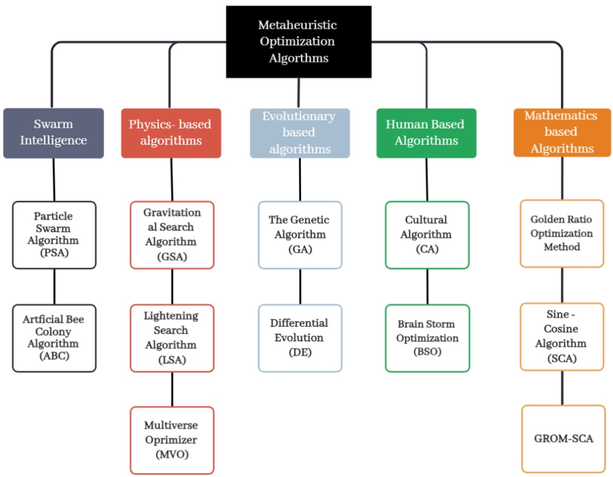
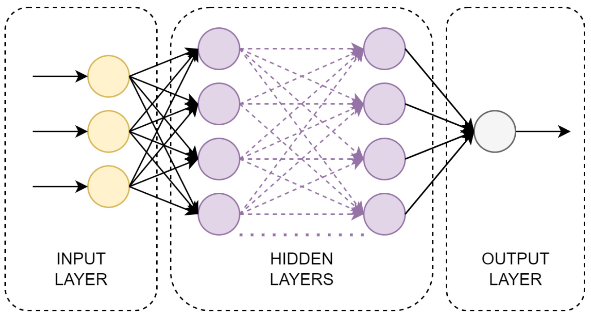
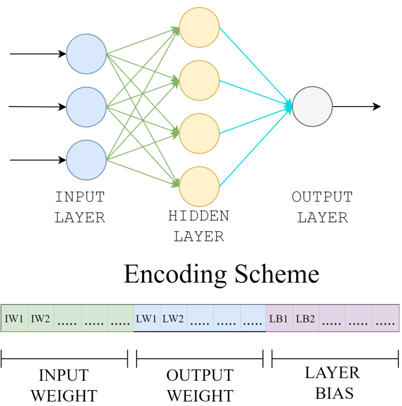
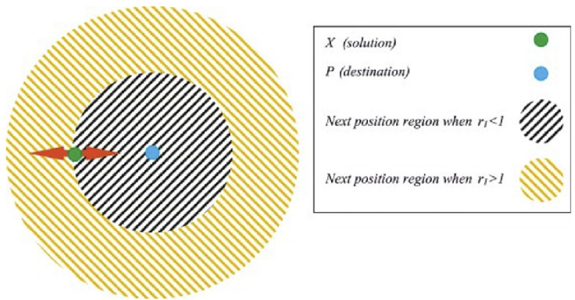
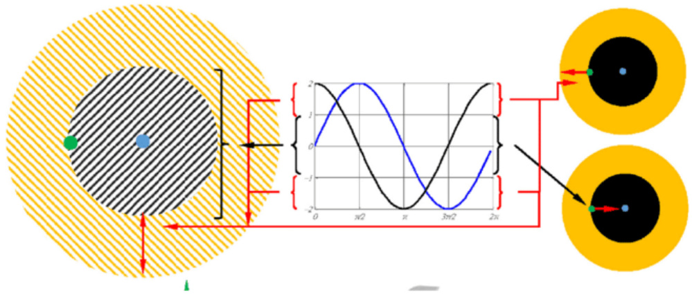

# Hybrid Modified Golden Ratio Optimization Method and Sine Cosine Algorithm for Training of feed-forward neural network  

Harshit Batra, Mukul Gupta, Kartik Bagri, Adwita Arora, Vijay Kumar Bohat  

Department of Computer Science, Netaji Subhas University of Technology, Azad Hind Fauj Marg, Sector - 3, Dwarka, New Delhi - 110078, India Center of Excellence in Artificial Intelligence, Netaji Subhas University of Technology, Azad Hind Fauj Marg, Sector - 3, Dwarka, New Delhi - 110078, India  

## Abstract  

The pursuit of optimizing Feedforward Neural Networks (FNNs) has been a key research area due to its direct correlation with the enhancement of network performance across varied applications. Conventional gradient-based methods, such as backpropagation, have laid the foundation for FNN training. However, their inherent limitations, such as susceptibility to local optima, slow and sluggish convergence rates, and sensitivity to initialization choices, have left room for improvement. Recognizing these challenges in the gradient-based methods, there has been an accelerated shift towards metaheuristic algorithms, which leverage stochastic search capabilities, offering an innovative lens to explore the intricate optimization landscapes of FNNs.  

In this backdrop, This study presents a novel hybrid approach by combining the capabilities of Golden Ratio Optimization Method with the Sine Cosine Algorithm, further enhanced by Le´vy flight. This method, tern as the Hybrid Golden Ratio Optimization Method and Sine Cosine Algorithm(GROM-SCA), this method encapsulates diverse inspirations: the universally recognized proportionality of the Golden Ratio, the inherent oscillatory behavior of the sine and cosine functions and the L´evy flight’s characteristic of promoting random, long-range exploration steps within the search space.  

To evaluate the effectiveness of The GROM-SCA algorithm it was evaluated on two sets of widely recognized benchmark test functions, namely the CEC 2014 and 23 well-known benchmark functions. In these evaluations, they exhibited notable improvements in performance when contrasted with other optimization algorithms. Further, the efficiency of the MROM approach in the context of training feedforward neural networks (FNNs) was assessed. This assessment involved a comparison with numerous state-of-the-art optimization techniques across a diverse array of 30 classification datasets. The resultant findings establish the exceptional performance of GROM, solidifying its status as a superior choice among competitive optimization methods when tackling a range of classification Problems.  

## Keywords:  

Golden Ratio Optimization Method, Sine - Cosine Algorithm, raining of feed-forward neural networks, Nature inspired algorithms, Metaheuristics.  

## 1. Introduction  

Artificial Neural Networks (ANNs) are a type of computational system that is inspired by the biological functioning of the human brain. These systems have been widely used in various fields such as pattern recognition [1], Natural Language Processing [2], Speech Recognition [3], and classification [4, 5, 6]. Their inherent capacity to approximate complex functions makes ANNs particularly adept at modeling non-linear relationships [7, 8, 9]. The architecture of an ANN comprises an interconnected assembly of artificial neurons, which receive inputs and compute corresponding outputs. These neurons, akin to their biological counterparts, engage in information processing and signal transmission to other interconnected neurons. This inter-neuron communication closely mirrors the signal propagation within the human brain. Crucially, each connection within this network is assigned a ”weight,” and the essence of network learning involves determining the optimal values of these weights in conjunction with an additional input factor known as the ”bias.”  

Feedforward Neural Networks (FNNs) [10, 11] stand as one of the most widely adopted and straightforward forms of artificial neural networks, extensively applied in tasks like speech recognition [12, 13], human face recognition [14, 15], and various other applications [16, 17, 18]. The architecture of a multilayer FNN has three main components: an input layer, one or more hidden layers, and an output layer. Out of which the hidden layers play a crucial role in processing information effectively, serving as intermediaries between the input and output layers. In a feedforward neural network, the flow of information is strictly unidirectional [10]. It commences with the input layer, progresses through any hidden layers, should they be incorporated (applicable especially in networks with multiple layers), and culminates in the output layer. This unidirectional flow is a defining characteristic of feedforward neural networks.  

Numerous algorithms have been devised for training feedforward neural networks, with Backpropagation [19] being the most prominent among them. Backpropagation is a variant of the gradient-descent algorithm [20] and is widely favored for its effectiveness in optimizing the network’s performance.The Backpropagation algorithm attempts to minimize the Mean Square Error (MSE) cost function [21]. However, it shares a common trait with many gradientdescent algorithms in that it exhibits a relatively modest convergence rate. This characteristic may render it susceptible to becoming trapped within local minima of the MSE cost function, thus limiting its ability to locate the global minimum efficiently. This highlights a significant challenge in optimizing neural networks. While Backpropagation remains an indispensable tool, its limitations necessitate ongoing research into more advanced optimization techniques that can effectively mitigate issues related to slow convergence and local minima entrapment.  

Over the years, the academic community has turned to meta-heuristic algorithms as promising tools for such complex optimization problems [22, 23, 24, 25]. These algorithms have their roots in diverse inspirations, spanning Swarm Intelligence (SI), laws of physics, the principles of evolution, human behavior, adaptive strategies of plants, and the realm of mathematics.  

Swarm Intelligence (SI) represents the pure essence of decentralized systems found in nature [26]. In these systems, individual agents, often simplistic in nature, interact with each other and their environment, resulting in emergent intelligent global behaviors. Algorithms taking cues from SI seek to emulate such collective behaviors and interactions to solve various optimization problems. Examples include the Artificial Bee Colony (ABC) algorithm [27], which mimics the food-foraging behavior of honey bee swarms, and the Particle Swarm Optimization (PSO) algorithm [28], an abstraction of the social behavior observed in flocks of birds. A significant contribution to this domain was made by Mendes et al. [29] They conducted an in-depth comparison of the conventional backpropagation methods with the PSO algorithm. The outcomes of their experiments exhibited the superiority of PSO in scenarios plagued with multiple local minima, making it a robust alternative in such neural network training contexts [29].  

Diving into the realm of physics-inspired algorithms, one encounters methodologies that are based on the principles and laws governing the physical world [30]. These algorithms translate the dynamism of natural physical phenomena into computational strategies. The Gravitational Search Algorithm (GSA) [31, 32], for instance, derives its foundation from Newton’s law of gravitation. Similarly, the Multiverse Optimizer (MVO) [33] conceptualizes the multiverse theory from cosmology, while the Lightning Search Algorithm (LSA) [34] replicates the erratic path of a lightning bolt.  

Evolutionary-based algorithms find their foundation in the Darwinian principle of natural selection [35]. These algorithms mimic the process of evolution where potential solutions to an optimization problem evolve over time. The Genetic Algorithm (GA) [36], for instance, draws parallels with biological processes such as crossover (recombination), mutation, and selection. Here, potential solutions are encoded as chromosomes, and through a series of generations, these chromosomes evolve, aiming to produce fitter solutions to the problem at hand. Over time, less optimum solutions are phased out in favor of more optimum ones, replicating the survival of the fittest paradigm. Another example is Differential Evolution (DE) [37], which employs mechanisms of mutation and crossover to optimize real-valued scalar functions.  

Human-based meta-heuristic algorithms are grounded in behaviors, characteristics, and cognitive processes distinctive to human beings. One noteworthy example in this category is the Cultural Algorithm (CA) [38]. This algorithm borrows from the realm of socio-cognitive theories, particularly the manner in which cultural knowledge evolves and impacts individual and collective problem-solving abilities. Cultural Algorithms maintain a belief space that represents shared knowledge, which influences and is influenced by individual problem-solving entities. Another fascinating algorithm under this category is the Brain Storm Optimization (BSO) algorithm [39]. Inspired by the human brainstorming process.  

On the mathematical frontier, several meta-heuristic algorithms have emerged, drawing upon foundational mathematical concepts and constants [40]. The Golden Ratio Optimization Method (GROM) is an example in this category. Nematollahi et al. [41] formulation of GROM harnesses the properties of the golden ratio, a number revered for its appearance across nature, art, and architectural marvels. What distinguishes GROM from many of its peers is the absence of tuning parameters. This makes it easier for researchers because they don’t have to do the time-consuming and often inaccurate job of parameter calibration. Recognizing its potential, researchers have harnessed GROM in various of real-world applications. For instance, its capability was harnessed for detecting the COVID-19 virus by enhancing clustering techniques, utilizing deep residual features [42]. Another application was in the domain of power networks, where it was employed to optimize power flow in systems laden with unpredictable renewable energy sources [43]. A more interdisciplinary approach was evident when it was Hybridized with equilibrium optimization algorithms in a hybrid meta-heuristic feature selection methodology, aimed at identifying speech emotions [44].  

Despite its innovative aspects, the GROM algorithm is not immune to criticism. Some researchers have identified certain limitations, such as its tendency to explore a limited range of solutions, a proclivity for slosw convergence, and occasional difficulties in escaping local optima. These shortcomings have spurred further research efforts aimed at refining the original GROM algorithm. Initial assessments suggest that these modified versions may provide a more balanced approach to both exploration and exploitation, particularly in the context of training Feedforward Neural Networks (FNNs).  

The Sine Cosine Algorithm (SCA) [45], like the Golden Ratio Optimization Method (GROM), is another mathematic based optimization algorithm. While GROM draws its inspiration from the golden ratio, SCA is centered around the periodic nature of trigonometric functions. This approach introduces a unique balance between exploration and exploitation in the search space, aiding in the identification of global and local optima.One of the defining features of the SCA is its dual-thread approach. By dividing its strategy into two distinct threads - global search and local development - SCA ensures a comprehensive scan of the solution space. While the global search employs major random fluctuations to explore unknown regions, the local development thread incorporates minor disturbances to intensively search in the vicinity of the present solution. This strategy, intrinsically rooted in the periodic oscillations of sine and cosine functions, provides SCA with a dynamic means to alternate between a broad-scale search and a fine-tuned, localized probe.  

In response to the limitations observed in the GROM algorithm, a novel optimization technique known as the GROMSCA algorithm has been introduced in this study. The development of the GROMSCA algorithm was prompted by the recognizing constraints of both the Golden Ratio Optimization method (GROM) and the Sine Cosine Algorithm (SCA). The GROMSCA algorithm distinguishes itself by combining the strengths of these two established optimization techniques, GROM and SCA. The GROM method excels in efficiently exploring the search space, whereas the SCA method is known for its capacity to rapidly converge towards solutions. Through this amalgamation, the GROMSCA algorithm attains a harmonious equilibrium between exploration and convergence, yielding enhanced performance when applied to real-world problems.  

To empirically validate the efficacy of the GROMSCA algorithm, an extensive evaluation was conducted on a set of 23 widely recognized benchmark problems. These benchmark problems are conventionally employed to assess the convergence characteristics of various nature-inspired optimization algorithms. The results of these evaluations demonstrated that the GROMSCA algorithm performed competitively when compared to state-of-the-art optimization techniques. In addition to these benchmark evaluations, the GROMSCA algorithm was also evaluated for the training of feedforward neural networks. The results of these evaluations showed that the GROMSCA algorithm was able to optimize the neural network with higher accuracy. Here the aim of this study is three-fold:  

• To propose a novel optimization algorithm, GROMSCA, that combines the strengths of the Golden Ratio Optimization method (GROM) and Sine Cosine Algorithm (SCA) methods.   
• To evaluate the effectiveness of the GROMSCA algorithm on a set of 23 well-known benchmark problems, which are commonly used to assess the convergence qualities of various nature-inspired optimization algorithms.  

  
Figure 1: Classification of Metaheuristic Algorithms  

• To evaluate the performance of the GROMSCA algorithm on a series of multilevel image thresholding problems, which involve identifying the most appropriate threshold value for an image.  

## 2. Related Work  

The optimization of feedforward neural networks is an area of high interest for researchers. Many different optimization algorithms have been proposed and applied to this task, each with its own strengths and weaknesses.One approach that has been proposed is the use of the Gaussian Particle Swarm Optimization (GPSO) by Min Han and Jun Wang [46]. Their results show that the model is competitive with other algorithms. Another approach is the hybrid optimization strategy proposed by Se´an McLoone et. al. [47]. This strategy combines gradient-descent methods of nonlinear weight optimization with single value decomposition for linear weight decomposition. The model was found to be superior when compared with other second-order gradient methods. Yue Xue et. al. [48] proposed the SPS-PSO (self-adaptive strategy and parameter based particle swarm optimization) to optimize the weight training of FNN. When compared with other evolutionary models, their model was found to be at an advantage. Jing-Ru Zhang et. al. [49] proposed a hybrid optimization technique for training FNN combining particle swarm and backpropagation. Their findings show that this approach is better than Adaptive particle swarm and backpropagation in terms of convergent accuracy and speed. Krzysztof Socha et. al. [50] presented a hybrid method consisting of Ant Colony Optimization (ACO) in addition to short runs of gradient descent algorithms (backpropagation). Results show that their algorithm is comparable to both genetic and gradient descent based algorithms. Elham Pashaei et. al. [51] proposed a black hole algorithm (BHA) combined with complementary learning algorithms and Le´vy flight random walk for training FNN. Results showed their method to outperform eight other well-known algorithms using metaheuristics in terms of accuracy. Leong Kwan Li et. al. [52] presented a new strategy called the convex combination algorithm (CCA) for the optimization of single hidden layer FNN. Their findings show that this approach proves to be good at finding the optimal values of weights post-training. Y. Zhang et. al. [53] proposed a Bacterial Chemotaxis Optimization (BCO) approach as an alternative to the backpropagation algorithm commonly used for the training of FNN. On comparison with Genetic Algorithms (GA) and Taboo Search (TS), their approach was found to be superior. Thi-Kien Dao et. al. [54] gave a hybrid model combining improved multi-verse optimizer (MVO) and FNNs for identifying data failure in cluster heads in wireless sensor networks. Their findings show that the proposed algorithm is effective in this task. Ilyas Benmessahel et. al. [55] optimized FNN trained to improve intrusion detection systems using locust swarm optimization (LSO). On comparing with other heuristic-based algorithms like particle swarm and genetic algorithms, the LSO algorithms were found to be better. Jie-Sheng Wang et. al. [56] optimized a feedforward neural network using a hybrid approach of combining particle swarm optimization and gravitation search algorithm on sensor modelling of floatation process. Their findings suggest that the model met online soft-sensor standards. Tahir $\mathbf{S}\mathrm{a}\breve{\mathbf{g}}$ et. al. [57] used the Vortex Search (VS) Algorithm for optimization of FNN and compared it to other popular optimization algorithms like Artificial Bee Colony Optimization (ABC), Particle Swarm Optimization (PSO), Simulated Annealing (SA), Genetic Algorithm (GA) and Stochastic Gradient Descent (SGD) algorithms. Their findings suggest that VS algorithm displays competitive performance to all other algorithms.  

  
Figure 2: Multi-Layer Perceptron Architecture  

## 3. Multi-layer Perceptron  

Multi-Layer Perceptron (MLP)[58] are mathematical models which belong to the family of Artificial Neural Networks (ANNs) called Feed-Forward Neural Networks (FNNs). They are comprised of one or more hidden layers, with each layer containing one or multiple neurons. As an extension of the perceptron network, it is one of the most widely utilized neural network models in practice. An MLP with a single hidden layer is referred to as a shallow neural network. With an adequate number of hidden neurons, a single hidden layer MLP is capable of providing a universal approximation for nearly any problem involving tabular data. If an MLP comprises multiple hidden layers, it is known as a deep neural network. The addition of more hidden layers may not necessarily provide substantial benefits, as it can lead to a higher number of trainable parameters and increase the risk of overfitting. Fig. 2 depicts a general architecture of an MLP, which consists of three layers of nodes: an input layer, a hidden layer, and an output layer. The data flows only in a forward direction, starting from the input nodes, passing through the hidden nodes, and ending up at the output nodes. Except for the input nodes, each node serves as a neuron that incorporates a bias and conducts computations utilizing a non-linear activation function.  

  
Figure 3: Encoding Scheme  

### 3.1. Encoding Technique  

The number of neurons in a feedforward neural network is determined by the task at hand. The input and output layers are determined by the number of features and classes in the dataset, while the number of neurons in the hidden layer can be estimated using the Kolmogorov theorem [59], which suggests that ”the number of hidden neurons should be 2 times the number of input neurons plus $1^{\prime\prime}$ .  

The process of determining the optimal weight and bias values for a multilayer perceptron (MLP) involves representing these values in a specific format. To accomplish this, a vector encoding technique is utilized, in which the initialized solutions are expressed as a population of size $N$ , denoted as $\boldsymbol{S}=(S_{1},S_{2},\ldots,S_{a},\ldots,S_{N})$ . Each member $\boldsymbol{S_{a}}=(n_{w},h_{b},h_{w},o_{b})$ encodes the set of biases and weights for a single-layer feedforward neural network. The MLP’s weight and bias values can be encoded as a vector and the size of vector is given using the following equation:  

$$
{\bf D}=(n\times h)+(h\times m)+|h_{b}|+|o_{b}|,
$$  

where $n,h$ , and $m$ are the number of input, hidden, and output neurons respectively, and $\left|h_{b}\right|$ and $\left\vert O_{b}\right\vert$ represent the cardinality of the set of biases of the hidden and output neurons. The weight values between the input and hidden layers are represented by $n_{w}$ and the weight values between the hidden and output layers are represented by $h_{w}$ . This vector encoding approach is commonly used in literature and is defined as:  

$$
\mathbf{P}=[w_{11},w_{12},\dots,w_{1h},w_{21},w_{22},\dots,w_{2h},\dots,w_{n1},w_{n2},\dots,w_{n h},h_{b1},h_{b2},\dots,h_{b h},o_{b1},o_{b2},\dots,o_{b m}],
$$  

where $P$ is the encoded vector, $w_{i j}$ denotes the weight between the $i^{t h}$ input neuron and the $j^{t h}$ hidden neuron, $h_{b j}$ represents the bias of the $j^{t h}$ hidden neuron, and $o_{b k}$ represents the bias of the $k^{t h}$ output neuron. Fig. 3 illustrates the coding scheme  

### 3.2. Computing the Fitness Value in Multi-Layer Perceptron  

The concept of a fitness function, also referred to as an objective function [60], is integral to assessing the effectiveness of a solution within a given problem domain. Within the context of a Multi-Layer Perceptron (MLP), the fitness value can be ascertained by following a two-step process.  

The initial step involves the computation of a weighted sum for each hidden neuron, as illustrated in Eq. 3:  

$$
s_{j}=\sum_{i=1}^{n}w_{i j}x_{i}+h_{b j}\qquad(j=1,2,...,h)
$$  

In this equation, $w_{i j}$ represents the weight affiliated with the connection between the $i^{t h}$ node in the input layer, and the $j^{t h}$ node within the hidden layer. The output value of the $i^{t h}$ node in the input layer is denoted as $x_{i}$ . Moreover, $h_{b j}$ symbolizes the bias linked with the $j^{t h}$ node in the hidden layer.  

The second phase involves calculating the output of the hidden neuron by applying an activation function to the previously calculated weighted sum of each hidden neuron. A variety of activation functions [61] exists, including ReLU [62], Leaky ReLU [63], and Tanh, among others. However, the sigmoid function is often favored due to its smooth gradient, preventing jumps in output values. The sigmoid function is represented in Eq. 4:  

$$
f(s_{j})={\frac{1}{1+e^{-s_{j}}}}
$$  

Once the output of the hidden layer nodes has been determined, the output of the neurons in the output layer can be computed using Eq. 5:  

$$
o_{k}=\sum_{j=1}^{h}w_{j k}f(s_{j})+o_{b k}\qquad(k=1,2,...,m)
$$  

In this equation, $w_{j k}$ designates the weight associated with the link between the $j^{t h}$ neuron in the hidden layer and the $k^{t h}$ neuron in the output layer. $o_{b k}$ , on the other hand, indicates the bias of the $k^{t h}$ neuron in the output layer. The output of each neuron in the output layer is also subjected to the sigmoid function, as shown in Eq. 6:  

$$
o_{k}=f(o_{k})=\frac{1}{1+e^{-o_{k}}}
$$  

The final step in calculating the fitness value of each solution within the proposed MLP algorithm involves the utilization of the mean squared error (MSE). The MSE is computed using the weight and bias matrices given to the MLP, as per Eq. 7:  

$$
M S E=\frac{1}{n}\sum_{i=1}^{n}(c_{i}-o_{i})^{2}
$$  

In this equation, $n$ denotes the number of training samples, $o_{i}$ refers to the predicted values rendered by the neural network, and $c_{i}$ signifies the actual class labels.  

In addition to the MSE, classification accuracy serves as a valuable metric for evaluating the classification performance of the MLP on unseen data. This accuracy can be calculated using Eq. 8:  

$$
A c c u r a c y={\frac{C S}{T S}}
$$  

In this equation, T S represents the total number of samples present in the test dataset, while $C S$ denotes the number of samples that have been correctly classified by the model.  

This comprehensive methodology allows for a systematic and objective evaluation of the Multi-Layer Perceptron’s performance. It accounts not only for the model’s predictive accuracy but also for the quality of its predictions, as measured by the MSE. These metrics provide a holistic view of the MLP’s fitness and its potential applicability to the problem at hand.  

## 4. Sine Cosine Optimization Algorithm  

The Sine Cosine Algorithm (SCA) [45] is an optimization algorithm inspired by trigonometric functions. It operates by initializing a random population and updating the solutions according to Eq. 9 and Eq. 10.  

$$
\begin{array}{r l}&{X_{i,n e w}^{j}=X_{i,o l d}^{j}+c_{1}\cdot s i n(c_{2})\cdot|c_{3}\cdot D_{i,o l d}^{j}-X_{i,o l d}^{j}|}\\ &{}\\ &{X_{i,n e w}^{j}=X_{i,o l d}^{j}+c_{1}\cdot c o s(c_{2})\cdot|c_{3}\cdot D_{i,o l d}^{j}-X_{i,o l d}^{j}|}\end{array}
$$  

Here, $X_{i,n e w}^{j}$ denotes the position of $i^{t h}$ agent in the $j^{t h}$ dimension at the current iteration while $X_{i,o l d}^{j}$ denotes the position of $i^{t h}$ agent in the $j^{t h}$ dimension at the previous iteration. The variables $c_{1},c_{2}$ , and $c_{3}$ are random constants, and $D_{i,o l d}^{j}$ is the destination point of the $i^{t h}$ agent in the $j^{t h}$ dimension in the previous iteration. This destination point is the location of the best solution found so far. this is illustrated in the Fiq. 4  

Traditionally, Eq. 9 and Eq. 10 are unified into a single equation, where the decision to update based on either equation is equally probable. This is formulated as follows:  

$$
X_{i,n e w}^{j}=\left\{\begin{array}{l l}{X_{i,o l d}^{j}+c_{1}\cdot\sin(c_{2})\cdot|c_{3}\cdot D_{i,o l d}^{j}-X_{i,o l d}^{j}|,}&{\mathrm{if~}k<0.5}\\ {X_{i,o l d}^{j}+c_{1}\cdot\cos(c_{2})\cdot|c_{3}\cdot D_{i,o l d}^{j}-X_{i,o l d}^{j}|,}&{\mathrm{if~}k\geq0.5}\end{array}\right.
$$  

In this equation, $k$ is a random number within the range [0,1]. The parameter $c_{1}$ is critical in determining the extent of exploration and exploitation in the SCA. In the initial stages of the algorithm, a larger value for $c_{1}$ is preferred to facilitate effective exploration. As the algorithm progresses, this value is gradually reduced according to Eq. 12:  

$$
c_{1}=a\cdot(1-t/T)
$$  

In this equation, $a$ is a constant, $t$ is the current iteration number, and $T$ is the total number of iterations permitted.   
The Sine Cosine Algorithm is detailed in Algorithm 1 and the Fig. ?? provides its graphical representation.  

### Algorithm 1: Sine Cosine Algorithm (SCA)  

1: Initialize population   
2: Specify the maximum number of iterations, $T$   
3: for $t=0\rightarrow T-1$ do   
4: Evaluate the cost function for each individual solution.   
5: Update the global best solution if a better one is found.   
6: Update the parameters $c_{1},c_{2},c_{3}$ , and $k$ .   
7: Update the position of each individual solution according to Eq. 9 or Eq. 10 based on the value of $k$ .   
8: end for  

## 5. Golden Ratio Optimization Method  

The Golden Ratio Optimization Method [41] is a derivative-free optimization algorithm that uses the golden ratio to search for the optimal solution to a problem.  

### 5.1. First Phase  

The first phase of the Golden Ratio Optimization Method (GROM) involves the random initialization of search agents within the search space of the problem. This is done by using the following equation:  

$$
X_{i}^{d}=L B^{d}+r a n d\times(U B^{d}-L B^{d})\quad\qquadi=1,2,3....N
$$  

where $N$ is the number of search agents, $X_{i}^{d}$ denotes the position of the $i^{t h}$ agent in the $d^{t h}$ dimension, and rand is a random value between [0,1]. The upper and lower bounds of the search space for the $d^{t h}$ dimension are represented by $U B^{d}$ and $L B^{d}$ , respectively. It is important to check that the search agents are within the predefined search space to avoid invalid solutions.  

  
Figure 4: Next Position Updation in Sine Cosine Algorithm[https://www.researchgate.net/publication/321271206˙A˙novel˙hybrid˙GW SCA˙approach˙for˙optimization˙problems cite this ]  

  
Figure 5: Fundamental Principle of the Sine Cosine Algorithm  

After the search agents have been randomly initialized, the worst agent is identified as $X_{w o r s t}$ , and the average position of all search agents is computed and denoted as $X_{a\nu e r a g e}$ . The fitness value of each search agent is evaluated based on the objective function of the problem being solved. If the fitness value of $X_{a\nu e r a g e}$ is better than that of $X_{w o r s t}$ , then $X_{a\nu e r a g e}$ is substituted for $X_{w o r s t}$ .  

### 5.2. Second Phase  

In the second phase of the Golden Ratio Optimization Method (GROM), the population set is iterated over for each search agent, denoted by $X_{i}$ . A random search agent, $X_{j}$ , where $i\neq j$ , is selected, and a comparison is made between $X_{i},X_{j}$ , and the average of the population set, $X_{a\nu e r a g e}$ . The best among the three is assigned as $X_{b}$ , the worst as $X_{w}$ , and the last one as $X_{m}$ . The fitness values of the three agents are ordered based on the inequality:  

$$
F_{b e s t}<F_{m e d i u m}<F_{w o r s t}
$$  

Next, a vector $\vec{X_{t}}$ is calculated as the difference between the medium and worst agents:  

$$
\vec{X_{t}}=\vec{X_{m}}-\vec{X_{w}}
$$  

To determine the magnitude of movement that will take place in the direction of the obtained vector $X_{b}$ , the golden number and the Fibonacci formula are employed. The Fibonacci formula is applied as follows:  

$$
F_{t}=G F*\frac{\phi^{t}-(1-\phi)^{t}}{\sqrt{5}}
$$  

Here, $G F$ is a constant with a value of 1.1618, $t$ is the inverse of the maximum number of iterations, and $\phi$ is the golden ratio constant.  

The new search agent position $X_{n e w}$ is then calculated using the equation:  

$$
X_{n e w}=(1-F_{t})X_{b}+r a n d F_{t}\vec{X_{t}}
$$  

Here, rand is a random value between 0 and 1. The new position is then evaluated to determine whether it improves the fitness of the current search agent. If it does, the search agent is updated with the new position. Otherwise, the search agent retains its old position. This process is summarized in the following equation:  

$$
X_{i}=\left\{\begin{array}{l l}{X_{n e w},}&{\mathrm{if~the~fitness~improves}}\\ {X_{o l d},}&{\mathrm{otherwise}}\end{array}\right.
$$  

Here, $X_{i}$ represents the position of the $i^{t h}$ agent, $X_{n e w}$ is its new position and $X_{o l d}$ is its previous position.  

### 5.3. Third Phase  

The third phase of the Golden Ratio Optimization Method (GROM) aims to approach the optimal agent. This is accomplished by using the Golden ratio to update the search agents through the following equation:  

$$
X_{n e w}=X_{o l d}+r a n d*\frac{1}{G F}*X_{b e s t}
$$  

Here, $X_{n e w}$ represents the updated position of the search agent, $X_{o l d}$ represents its previous position, rand is a randomly generated value between [0,1], $G F$ is a constant with a value of 1.1618, and $X_{b e s t}$ represents the best agent among all the agents in the population. This equation helps the search agents approach the optimal agent.  

The algorithm checks if the updated position is within the specified search space, and if not, brings it back into the search space. If the updated position results in improved fitness for the current search agent, the new position replaces the previous one as shown in the following equation:  