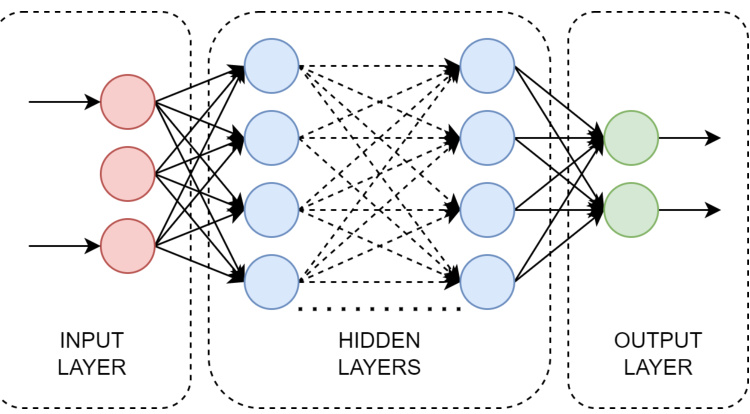
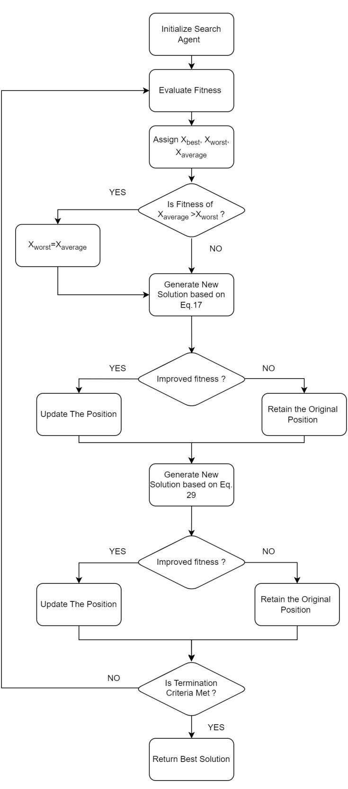
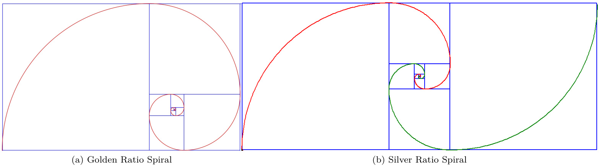
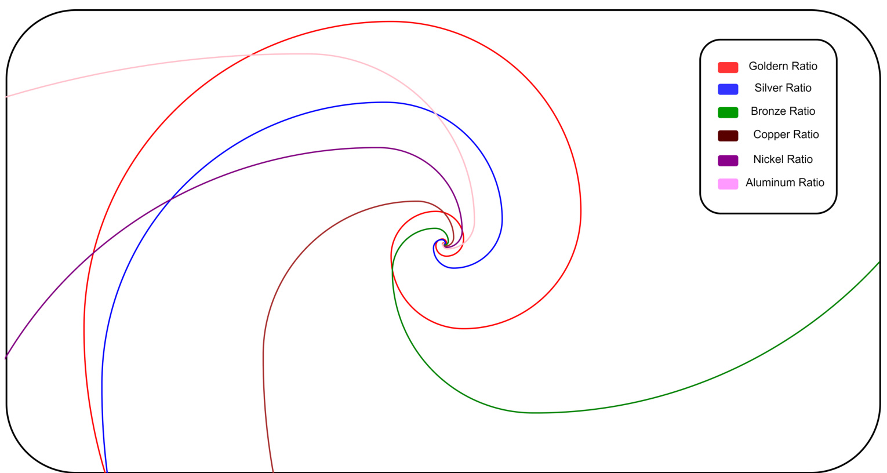
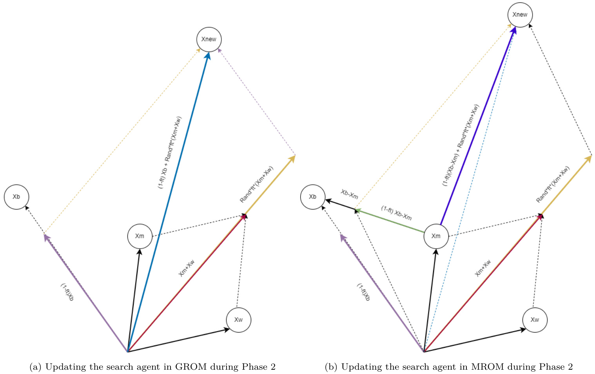
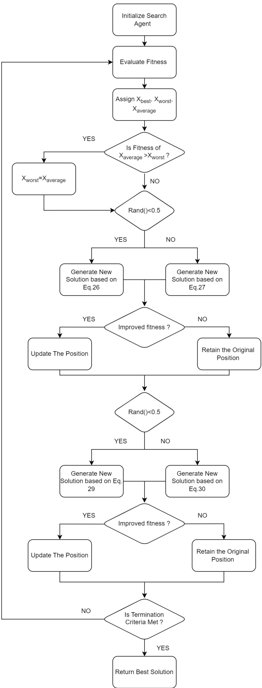
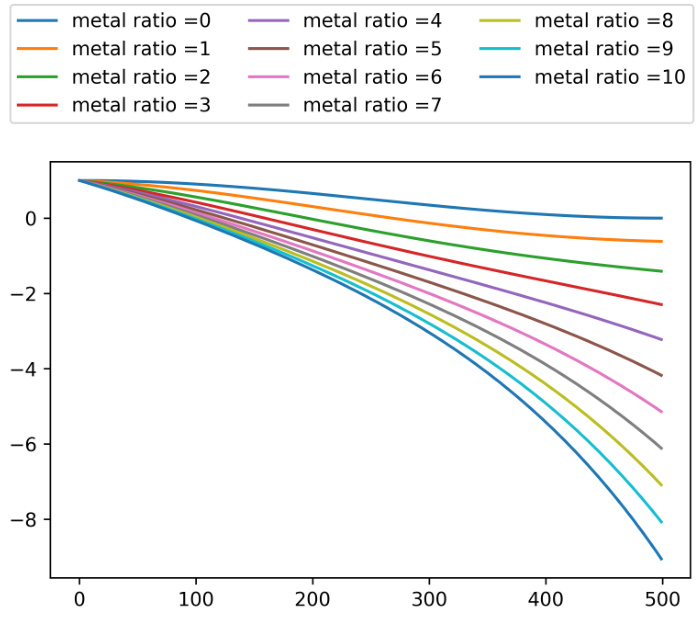

# Metal ratio optimization method for training of feed-forward neural networks  

Harshit Batra $^{1,2}$ , Vijay Kumar Bohat2 $^1$ Centre of Excellence in AI, Netaji Subhas University of Technology, Dwarka, New Delhi-110078, India 2 Department of Computer Science & Engineering, Netaji Subhas University of Technology, Dwarka, New Delhi-110078, India  

Abstract  

Training a feed-forward neural network (FNN) presents a significant challenge. Traditional methods often rely on gradient-based techniques, which are prone to getting trapped in local optima. This study proposes a novel approach for FNN training by enhancing the Golden Ratio Optimization Method (GROM)  

GROM is a recently introduced nature-inspired optimization method based on the golden ratio, which has shown good performance in solving real-world problems. One of the key strengths of GROM is its simplicity and unlike many other optimization methods, GROM does not require any tuning parameters to be set by the user. This makes it an attractive choice for researchers who want a straightforward optimization method that can be easily applied to a wide range of problems. However, GROM faces issues with slow convergence and a tendency to get stuck in local optima. To overcome these problems, a novel optimization framework named the Metal Ratio Optimization Method (MROM) has been proposed in this study. The search mechanism of GROM has been improved, and various metal ratios have been explored in the proposed framework. The MROM-based algorithms were tested on two groups of well-known benchmark test functions, and they showed improved performance compared to GROM and other gradientbased optimisation techniques. Furthermore, the efficiency of MROM in training feedforward neural networks has been evaluated and compared with several state-of-the-art optimization methods on 30 classification datasets. The results demonstrate the outstanding performance of MROM compared to other competitive optimization methods on various classification problems.  

Keywords:  

Feed-Forward Neural Network, Golden Ratio Optimization Method, Metal Ratio, Meta-heuristic, Optimization algorithm, Nature inspired Algorithms.  

## 1. Introduction  

Artificial Neural Networks (ANNs) (Grosan & Abraham (2011)) are highly effective machine learning tools inspired by the human brain (Fausett (2006)). Over the years, they have become a vital tool for modeling and simulating complicated nonlinear systems (Abiodun et al. (2018)). ANNs have been widely used in a range of fields including pattern recognition (Bridle (1990)), function approximation (Smith & Boning (1997)), time series prediction (Hamza¸cebi (2008); Tealab et al. (2017)), classification (Chen et al. (2014); Mahmon & Ya’acob (2014)), signal processing (Azad et al. (2016)), system identification and control (Gautam (2016); Li et al. (2016)), and many others (Marug´an et al. (2018); Cachim & Bezuijen (2019); Marinkovic´ et al. (2020); Lin et al. (2020)).  

In general, ANNs refer to a diverse set of mathematical models that are characterized by the presence of interconnected units known as artificial neurons (Yegnanarayana (2009)). Over the past three to four decades, a plethora of  

ANN models have been proposed, including feed-forward neural networks (FNNs) (Bebis & Georgiopoulos (1994)), recurrent neural networks (RNNs) Sherstinsky (2020), radial basis functions (RBFs) (Buhmann (2000)), Kohonen self-organizing networks (KSONs) (Buhmann (2003)), and spiking neural networks (SNNs) (Ghosh-Dastidar & Adeli (2009)). Among these, Feedforward Neural Networks(FNNs) have garnered significant attention from machine learning researchers, due to their distinct non-cyclic structure (Svozil et al. (1997)).  

FNNs have three main components, namely network architecture, optimizer/training algorithm, and activation function (Yegnanarayana (2009)). The architecture of the network determines the way neurons are connected, the optimizer/training algorithm calculates the weights and biases of the neural network, and the activation function determines the state of each neuron based on the inputs it receives.  

The performance of FNNs is closely tied to both the network structure (a function) and the weights (the parameters of the function). To determine appropriate weights, it is necessary to employ the proper optimization techniques or training algorithms. Throughout the past few decades, researchers have employed a range of optimization techniques to refine FNN models, with gradient-based optimization being a commonly used method among early researchers in the field (Jameson (1995); Haji & Abdulazeez (2021); Ruder (2016)). However, due to limitations in gradient-based techniques (Shalev-Shwartz et al. (2017)), researchers have shifted their focus towards alternative optimization methods, such as meta-heuristic optimization (Glover & Kochenberger (2006); Chopard & Tomassini (2018)). Nature-inspired optimization algorithm (NIAs) are noted for their ability to handle complex, nonlinear, and non-differentiable problems, which traditional methods are unable to address as they require a continuous and differentiable objective function.  

Over the years, a variety of Nature-inspired optimization techniques have been used to train FNNs (Ojha et al. (2017)). The first implementation was by Montana & Davis (1989) using the well-known Genetic Algorithm (GA), which was inspired by Darwin’s natural selection and evolution theories. Ku et al. (1995) used a cellular genetic algorithm for training recurrent neural networks. Shaw & Kinsner (1996) introduced chaotic simulated annealing, which is effective at escaping local optima in multi-layer feed-forward neural network training. Zhang et al. (2007) proposed a hybrid particle swarm optimization (PSO)- back propagation algorithm. Kuo et al. (2010) integrated particle swarm optimization-based fuzzy neural network and artificial neural network for supplier selection. Wang et al. (2015) hybridized PSO and ABC to train FNN for abnormal brain identification. Zhang et al. (2016) developed a novel fruit classification framework using a biogeograph based optimization technique. Huang & Chou (2019) combined particle swarm optimization, gravitational search algorithm, and fuzzy rules to improve feed-forward neural network classification performance. Luo et al. (2020) proposed a deep feed-forward neural network with a genetic algorithm for estimating power use in buildings. Other optimization algorithms used for FNN training include Differential evolution (DE) (Price (2013); Bilal et al. (2020)), evolution strategy (ES) (Bilal et al. (2020)), and grey wolf optimizer(GWO) (Mohamed et al. (2015); Amirsadri et al. (2018)).  

The use of NIAs for solving optimization problems is challenged by the presence of multiple tuning parameters, making it difficult to find the optimal values. These parameters play a crucial role in the success of these algorithms and therefore, reducing the number of tuning parameters has become a focus for researchers. To overcome this issue, efforts are being made to develop new optimization algorithms with fewer tuning parameters. Golden Ratio Optimization Method (GROM) is a recently introduced optimization algorithm developed by Nematollahi et al. (2020) The GROM algorithm is inspired by the golden ratio, which is a mathematical ratio that is found in many natural phenomena, including the arrangement of leaves on a stem and the spiral patterns in seashells.THe method has shown promising results in solving various optimization problems and is particularly advantageous due to its lack of tuning parameters. This eliminates the need for calibrating parameters, making it a desirable option compared to other algorithms. Researchers have applied GROM to real-world problems such as COVID-19 virus detection through improved clustering techniques (Chattopadhyay et al. (2021)), optimal power flow management in a power network with stochastic renewable energy resources (Nusair & Alasali (2020)), and speech emotion recognition through a hybrid meta-heuristic feature selection method (Dey et al. (2020)).  

However, GROM suffers form various limitations including limited exploration potential, slow convergence, and a tendency to get stuck in local optima. Nematollahi et al. (2020) only considered the Golden ratio in the formulation of GROM leaving other metal ratios unexplored. another issue with GORM is the utilization of only the best solution for the updation of GROM’s search agent which results in a potential drawback of being prone to local optima, a phenomenon where the agent may converge towards suboptimal solutions in the vicinity of the current position, impeding its ability to explore the entire solution space. Hence to overcome this a new search mechanism is introduced to GROM. This study aims to address these limitations by proposing a modification to GROM and evaluating various metal ratios. The results of the performance evaluation show that the proposed modification offers a better balance between exploration and exploitation, especially for the training of FNNs. The primary objective of this research paper is twofold.  

• Firstly, a novel MROM framework is introduced and its performance is evaluated against the GROM approach using standard benchmark function problems. • Secondly, the effectiveness of the MROM framework is analyzed through a comparative study with other state-of-the-art metaheuristics for the training of feedforward neural networks (FNN) problem.  

The rest of the paper is organized as follows. The next section describes the problem of training FNNs. Section 3 introduces the Golden Ratio optimization method, while Section 4 presents the proposed Metal Ratio optimization method (MROM). Section 5 explains how to train a Feed Forward Neural Network using MROM. In Section 6, the experimental results on 23 well-known benchmark functions (Ling et al. (2017); Nabil (2016)) and CEC 2014 test suite (Liang et al. (2013)) are presented. Also, a comparative performance analysis of our proposed framework with its peers for the problem of training FNNs has been provided. Finally, the discussion is concluded in the last section.  

## 2. Feedforward Neural Networks  

Feedforward neural network (FNN) has a special place among neural network designs because of their straightforward architecture, which is composed of multiple neurons organized in layers where each layer is fully connected to the preceding one. Input is fed into the first layer (input layer) and the output is produced from the last layer (output layer). Hidden layers are situated between the input and output layers. The neurons in FNN are connected in a unidirectional manner. Connections are represented by real numbers called weights, which lie between $-1$ and 1. Fig. 1 shows an example of a simple FNN architecture. It has $n$ nodes in the input layer, $m$ nodes in the hidden layer, and $k$ nodes in the output layer. With the exception of the input layer, the output of each node in every layer is calculated in two steps. Firstly, the output is calculated using the weights and biases of the network, followed by an activation function that activates the network based on the weighted sum of the node’s inputs. There are various activation functions (Bhoi et al. (2021); Nwankpa et al. (2018)) available in the literature, but one of the most widely used and popular activation functions is the sigmoid function. The following mathematical steps describe the FNN model: Inputs to the hidden layer node are calculated using Eq. 1.  

  
Fig. 1: A representative FNN Architecture  

$$
S_{j}=\sum_{i=1}^{n}(W_{i j}.X_{i})-b_{j},~j=1,2,3.....,m
$$  

Here, $W_{i j}$ denotes the weight of the connection from the $i^{t h}$ node in the input layer to the $j^{t h}$ node in the hidden layer and $n$ is the number of input nodes. The bias of the $j^{t h}$ hidden node is represented by $b_{j}$ , and the input value is represented by $X_{i}$ . To calculate the output of each hidden layer node, the following calculation is performed using the sigmoid function:  

$$
S_{j}=s i g m o i d(s_{j})=\frac{1}{(1+e x p(-s_{j}))},~j=1,2,3.....,m
$$  

The weighted sum of inputs to the output layer nodes is determined using the following equation:  

$$
o_{h}=\sum_{j=1}^{m}(W_{j h}.S_{j})-b_{j}^{'},~h=1,2,3.....,k
$$  

Here, weight of the connection between the $j^{t h}$ hidden layer node and the $h^{t h}$ output layer node is represented by $W_{j h}$ , and the bias of the $h^{t h}$ output node is indicated by the variable $b_{j}^{'}$ .  

The final output of the FNN may be calculated using Eq. 4.  

$$
O_{h}=s i g m o i d(o_{h})=\frac{1}{(1+e x p(-o_{h}))},~h=1,2,3.....,k
$$  

Since, achieving the lowest possible performance error for both training and testing data is the fundamental goal of neural network training. There are many metrics to evaluate the performance of neural networks. Mean Square Error (MSE) is a popular measure for assessing FNN. It calculates the difference between the output produced by the FNN and the actual desired output. $M S E$ calculation is done using the following formula:  

$$
M S E=\sum_{i=1}^{k}(o_{i}^{c}-d_{i}^{c})^{2}
$$  

The desired output from the $i^{t h}$ neuron(output layer) of FNN when the $c^{t h}$ training sample is utilised is $d_{i}^{c}$ , and the observed output of the $i^{t h}$ neuron(output layer) of FNN is $o_{i}^{c}$ . Every FNN must adjust the values of its weights and biases on all of the training data-set supplied in order to realize the lowest possible error rate; hence, the effectiveness of an FNN is determined by computing its average Mean Square Error ( $M S E$ ) across all of the training data as follows:  

$$
\overline{{M S E}}=\sum_{c=1}^{s}\frac{\sum_{i=1}^{k}(o_{i}^{c}-d_{i}^{c})^{2}}{s}
$$  

where the quantity of training samples is represented by $s$ . With weights, biases, and average MSE as variables, the objective function for FNN training can be written as follows:  

$$
M i n i m i z e\ F(X)=\overline{{M S E}}
$$  

Here, the set of vectors $X$ stands for the weights and biases of the FNN.  

## 3. Golden Ratio Optimization Method  

The Golden Ratio Optimization Method (GROM) is a recent nature-inspired algorithm inspired by the Fibonacci series and the Golden ratio. The Fibonacci numbers, denoted as $F_{n}$ , form a sequence where each number is the sum of the two preceding numbers, typically starting with $0$ and 1. The golden ratio is a number frequently observed in nature. The concept of the golden ratio can be represented by Eq. 8.  

$$
X_{n}={\frac{\phi^{n}-(1-\phi)^{n}}{\sqrt{5}}}
$$  

  
Fig. 2: Flow Chart Representing GROM  

Here, $X_{n}$ represents the $n^{t h}$ term of the Fibonacci series and $\phi$ represents the Golden ratio, which is approximately equal to 1.618034.  

The GROM operates in three phases, which are described in detail in the following subsections.  

### 3.1. First Phase  

The GROM method starts with initializing search agents, with each agent’s location being represented as follows:  

$$
X_{i}=x_{i}^{1},...,x_{i}^{n},...,x_{i}^{d i m}\quad\quad\quad\quad\quad\quad\quad\quad i=1,2,...,N_{}
$$  

In the above representation, $N$ represents the number of agents in the search space, dim is the pre-specified dimension of the given objective function, and $\boldsymbol{x}_{i}^{n}$ denotes the location of the $i^{t h}$ agent in the $n^{t h}$ dimension. To make sure that the agents are within the pre-determined search space, a boundary condition check is performed. Any agents located outside the search space are clipped back into it.  

Next, the fitness of each search agent is evaluated based on the objective function. The best agent is labeled as $X_{B e s t}$ , the worst agent as $X_{w o r s t}$ , and $X_{a v e r a g e}$ represents the average of the positions of all search agents. If the fitness of $X_{a v e r a g e}$ is found to be higher than the fitness of $X_{w o r s t}$ , then $X_{w o r s t}$ is replaced by $X_{a v e r a g e}$ .  

### 3.2. Second Phase  

The second phase of GROM involves iterating through the population set. For each search agent $X_{i}$ , a different search agent $X_{j}$ is randomly selected, with $i\neq j$ . Then, a comparison is made between $X_{i}$ , $X_{j}$ , and $X_{a v e r a g e}$ , and the best is labeled as $X_{b}$ , the worst as $X_{w}$ , and the medium as $X_{m}$ . The fitness relationship between $X_{b}$ , $X_{w}$ , and $X_{m}$ is depicted in Eq. 10.  

$$
\begin{array}{l}{{F_{b}<F_{m}<F_{w}}}\\ {{\displaystyle\overrightarrow{X_{t}}=\overrightarrow{X_{m}}+\overrightarrow{X_{w}}}}\end{array}
$$  

To find out the extent of movement in the direction of the vector $X_{b}$ obtained, the golden ratio and the Fibonacci formula are employed and presented in Eq. 12.  

$$
F_{t}=G F*\frac{\phi^{T}-(1-\phi)^{T}}{\sqrt{5}}G F=1.1618
$$  

$$
G F=1.1618
$$  

$$
T=t/t_{m a x}
$$  

The step size $F_{t}$ used to update the locations of the search agents is defined by the current iteration $t$ , the maximum number of iterations $t_{m a x}$ , and the golden ratio factor $G F$ . The objective of this position update is to enhance the best solution in the population, and a random component is added to the new solution for effective exploration of the search space. The solutions are updated stochastically  

using the Eq. 15. The value of $F_{t}$ is calculated using Eq.   
12 and the value of $X_{t}$ is obtained from Eq. 11.  

$$
X_{n e w}=(1-F_{t})X_{b}+r a n d*F_{t}*X_{t}
$$  

The updated position of the search agent is only accepted if it results in an improvement in fitness as per Eq. 16. If the new position falls outside the search space, the search agent is brought back within the search space.  

$$
\left\{\begin{array}{l l}{X^{i}=X_{n e w}^{i}}&{I f t h e f i t n e s s i m p r o v e s}\\ {X^{i}=X_{o l d}^{i}}&{o t h e r w i s e}\end{array}\right.
$$  

### 3.3. Third Phase  

In the third phase of the algorithm, the focus shifts from avoiding the worst agent to approaching the optimum solution. The method employs the golden ratio in its approach as presented in Eq. 17.  

$$
X_{n e w}=X_{o l d}+r a n d*\frac{1}{G F}*X_{b e s t}
$$  

The GROM method verifies the upper and lower limits of the variables once more. If a search agent is located outside the search space, it is brought back. If the new fitness is better, the previous solution is replaced by the new one as indicated in Eq. 18. The GROM method is summarized in Fig. 2 and its pseudocode is given in Algorithm 1.  

$$
\left\{\begin{array}{l l}{X^{i}=X_{n e w}^{i}}&{I f t h e\ f i t n e s s\ i m p r o v e s}\\ {X^{i}=X_{o l d}^{i}}&{o t h e r w i s e}\end{array}\right.
$$  

Even though GROM outperforms many of the stateof-the-art algorithms. However, it has the tendency to prematurely converge on a local optimal solution. Also, the GROM framework has only explored the golden ratio. Hence, to address these concerns the next section presents an enhanced framework based on GROM exploring various metal ratio’s.  

## 4. Metal Ratio Optimization Method  

Fig. 3a displays a logarithmic spiral that has the Golden ratio as its growth factor. According to the standard GROM search mechanism, the ability of the search agent to avoid local optima is determined by the value of the Golden ratio. Fig. 3b provides a logarithmic spiral that has the Silver ratio as its growth factor. From Fig. 3a and 3b, it can be seen that different metal ratios result in different balances between exploration and exploitation. Hence, it is worthwhile to study various metal ratios within the context of GROM. Fig. 4 illustrates different logarithmic spirals that are based on the growth rate of various metal ratios.  

The MROM framework proposed in this section offers two significant advancements over the GROM method:  

Instead of relying solely on the Golden ratio, the MROM framework explores a range of metal ratios to weigh the  

Algorithm 1 Golden Ratio Optimization Method (GROM)  

1: Initialize population, set maximum number of iterations as ttotal   
2: Evaluate the fitness $f(X_{i})$ for each search agent $X_{i}$   
3: Set the best solution to be $X_{b e s t}$ , worst solution to be $X_{w o r s t}$ , and arithmetic mean of the population to be Xaverage   
4: if Fitness of $X_{a v e r a g e}<X_{w o r s t}$ then 5: $X_{w o r s t}=X_{b e s t}$   
6: end if   
7: Check for Boundary condition   
8: $t=0$   
9: while $t<t_{t o t a l}$ do   
10: for $i=1$ to $N$ (where $N$ is population size) do   
11: randomly select $X_{j}$ where $i\neq j$   
12: Among $X_{i}$ , $X_{j}$ , and $X_{a v e r a g e}$ , set the best solution as $X_{b}$ , worst solution as $X_{w}$ , and middle solution designated as $X_{m}$ , respectively.   
13: Update the search agent’s location based on the Eqs. 11-15   
14: end for   
15: for $i=1$ to $N$ (where $N$ is population size) do   
16: Update the search agent’s location based on the Eqs. 17-18   
17: end for   
18: Check for Boundary condition   
19: $t=t+1$   
20: end while   
21: Output the best solution  

  
Fig. 3: Spiral for Golden and silver ratio  

  
Fig. 4: Spiral for different metal ratios, Red for Golden ratio, Blue for Silver ratio, Green for Bronze Ratio, Brown for Copper Ratio, Purple for Nickel Ratio, and Pink for Aluminum Ratio  

balance between exploration and exploitation. These metal ratios are displayed in Table 4.  

MROM framework also introduces an enhanced search mechanism to address the issue of premature convergence present in GROM. This improved approach allows MROM to thoroughly search the problem search space and effectively find the optimal solution. A phase-wise description of the algorithm is provided in the following subsections.  

### 4.1. Phase 1  

Phase one of the proposed MROM framework resembles the GROM method. MROM begins with the initialization of search agents, each agent’s location in the search space is indicated as follows:  

$$
X_{i}=x_{i}^{1},...,x_{i}^{n},...,x_{i}^{d i m}\phantom{...\qquad}i=1,2,...,N
$$  

In Eq. 19 $N$ depicts the number of agents in the search space, dim is a pre-specified dimension of the given objective function, and $\boldsymbol{x}_{i}^{n}$ is the location of the $i^{t h}$ agent in the $n^{t h}$ dimension.  

The $X_{B e s t}$ , $X_{w o r s t}$ , and $X_{a v e r a g e}$ are determined in similar way to GROM.  

### 4.2. Phase $\mathcal{Z}$  

The second stage of MROM Framework, similar to GROM, starts by iterating on each search agent. For each search agent $X_{i}$ , another agent $X_{j}$ is chosen randomly, ensuring that $i\neq j$ . The three agents, $X_{i}$ , $X_{j}$ , and $X_{a v e r a g e}$ , are then compared to determine the best $(X_{b}$ ), worst $\left({{X}_{w}}\right)$ , and medium $\left(X_{m}\right)$ agents. The fitness relationship between $X_{b}$ , $X_{w}$ , and $X_{m}$ is expressed in Eq. 20. Eq. 21 and 22 provide the movement vectors $\overrightarrow{X_{t}}$ and $\overrightarrow{X_{t1}}$ based on the values of $X_{b}$ , $X_{w}$ , and $X_{m}$ . These vectors will be utilized to update the position of each search agent.  

$$
\begin{array}{r l}&{F_{b}<F_{m}<F_{w}}\\ &{\overrightarrow{X_{t}}=\overrightarrow{X_{m}}+\overrightarrow{X_{w}}}\\ &{\overrightarrow{X_{t1}}=\overrightarrow{X_{b}^{\prime}}-\overrightarrow{X_{m}^{\prime}}}\end{array}
$$  

Unlike the GROM, a generalized Fibonacci’s formula is used in MROM framework presented through Eq. 23-25.  

$$
F_{t}=M R*{\frac{M R^{T}-(m-M R)^{T}}{\sqrt{m^{2}+4}}}
$$  

$$
M R=(m+\sqrt{(m^{2}+4)}))/2
$$  

$$
T=t/t_{m a x}
$$  

Here, $M R$ is the metal ratio, $m$ is the metal ratio number, $t_{m a x}$ is the maximum number of iterations, and $t$ is the current iteration number. Fig. 7 highlights the difference in $F_{t}$ value for various metal ratio.  

In GROM, the new position of the search agent mainly depends on $X_{b}$ can be seen through Eq. 15. However, this does not promote exploration of the search space. To balance between exploration and exploitation, the suggested method utilizes both $X_{b}$ and $X_{t1}$ with equal probability. In MROM, if the rand() is $<0.5$ then use Eq. 26 else use Eq. 27.  

$$
\begin{array}{c}{{X_{n e w}=(1-F_{t})X_{b}+r a n d*F_{t}*X_{t}}}\\ {{X_{n e w}=(1-F_{t})X_{t1}+r a n d*F_{t}*X_{t}}}\end{array}
$$  

Fig. 5 visually highlights the difference in the updation rule for GROM and MROM. If the equation improves the fitness of the current search agent update the search agent else retain the old position as shown in Eq. 28. If the new position of the agent is found to be outside of the search space bring back the search agent to the search space.  

$$
\left\{\begin{array}{l l}{X^{i}=X_{n e w}^{i}}&{I f t h e\ f i t n e s s\ i m p r o v e s}\\ {X^{i}=X_{o l d}^{i}}&{o t h e r w i s e}\end{array}\right.
$$  

Where $X_{o l d}$ is the old position of the search agent.  

### 4.3. Phase 3  

In contrast to GROM, the third phase of MROM Framework focuses on thoroughly exploring the search space in addition to avoiding the worst agent and making a concerted effort to approach the optimal agent. Consequently, the method uses two equations i.e., Eq. 29 and 30 that are applied with equal probability to achieve the same as follows :  

$$
X_{n e w}=X_{o l d}+r a n d*\frac{1}{M F}*X_{b e s t}
$$  

$$
X_{n e w}=(X_{o l d}-X_{b e s t})+r a n d*\frac{1}{M F}*(X_{m e a n}-X_{w o r s t})
$$  

If the agent is found to be outside the search space it is brought back. If the fitness improves, the new solution would be replaced by the previous one, as seen below in Eq. 31:  

$$
\left\{\begin{array}{l l}{X^{i}=X_{n e w}^{i}}&{I f t h e f i t n e s s i m p r o v e s}\\ {X^{i}=X_{o l d}^{i}}&{o t h e r w i s e}\end{array}\right.
$$  

Fig. 6 summarizes the GROM Method. Algorithm 2 provides the pseudo-code for the MROM method  

### 4.4. Complexity Analysis of MROM and GROM  

This Section explores and contrasts the computational complexity of MROM and its counterpart GROM.  

#### 4.4.1. Phase 1  

Initialization of the population forms the first step of phase 1. Initialization can be achieved in $O(n\times d)$ , here, $n$ is the population size and $d$ is the dimension of the problem. Examination of each agent’s fitness forms the second step in phase 1. This is realizable in linear time for each iteration since this step is repeated for all iterations assuming that the objective function has a computational cost  

Table 1: Metal ratios and their values   

<html><body><table><tr><td>Name of Metal Ratio</td><td>m</td><td>Ratio</td><td>Value(till 4 decimals)</td></tr><tr><td>Platinum</td><td>0</td><td>(0 +V4) / 2</td><td>1</td></tr><tr><td>Golden</td><td>1</td><td>(1 +v5) / 2</td><td>1.6180</td></tr><tr><td>Silver</td><td>2</td><td>(2 +√8) / 2</td><td>2.4142</td></tr><tr><td>Bronze</td><td>3</td><td>(3 + √13) /2</td><td>3.3027</td></tr><tr><td>Copper</td><td>4</td><td>(4 + √20) /2</td><td>4.2360</td></tr><tr><td>Nickel</td><td>5</td><td>(5 + √29) /2</td><td>5.1925</td></tr><tr><td>Aluminum</td><td>6</td><td>(6 + √40) /2</td><td>6.1622</td></tr><tr><td>Iron</td><td>7</td><td>(7 +√53) /2</td><td>7.1400</td></tr><tr><td>Tin</td><td>8</td><td>(8 + v68) /2</td><td>8.1231</td></tr><tr><td>Lead</td><td>9</td><td>(9 + √85) /2</td><td>9.1097</td></tr></table></body></html>  

  
Fig. 5: Difference between updation rule in GROM and MROM  

  
Fig. 6: Flow Chart Representing MROM Algorithm  

1: Initialize population and set maximum iteration to $t_{t o t a l}$ and $\mathrm{{t}=0}$   
2: while $t<t_{t o t a l}$ do   
3: Evaluate the fitness $f(X_{i})$ for each search agent $X_{i}$   
4: Set the best solution as $X_{b e s t}$ , worst solution as $X_{w o r s t}$ , and arithmetic mean of the population to be Xaverage   
5: if fitness of $X_{a v e r a g e}<X_{w o r s t}$ then   
6: $X_{w o r s t}=X_{a v e r a g6}$ e   
7: end if   
8: Check for Boundary condition   
9: for $i~=~1$ to N (where n is population size) do   
10: randomly select $X_{j}$ where i!=j   
11: Set the best solution among $X_{i}$ , $X_{j}$ , $X_{a v e r a g e}$ as $X_{b}$ , second-best solution as $X_{m}$ , and assign third best to $X_{w}$ , respectively   
12: if rand()<0.5 then   
13: Generate the search agent’s location depending on the Eq. 26   
14: else   
15: Generate the search agent’s location depending on the Eq. 27   
16: end if   
17: Verify constraints and update position based on Eq. 28   
18: end for   
19: for $i\ =\ 1$ to N (where n is population size) do   
20: if rand() $<0.5$ then   
21: Generate the search agent’s location depending on the Eq. 29   
22: else   
23: Generate the search agent’s location depending on the Eq. 30   
24: end if   
25: Verify constraints and update position based on Eq. 31   
26: end for   
27: $\mathrm{t}=\mathrm{t}+1$   
28: end while   
29: Output the best solution $X_{b e s t}$  

  
Fig. 7: Variation of $1-F_{t}^{\phantom{}}$ for various metal ratios  

$c$ . Therefore, the computational cost is $O(n\times c)$ for each iteration making the overall computational cost for all iterations $O(M\times(c\times n))$ , where $M$ is the maximum number of iterations. Determining the best and worst agents may be done concurrently utilizing linear time. While finding the average position of all the agents can be done in constant time. Therefore, overall the time complexity of phase 1 of both algorithms is presented in Eq. 32 and 33  

$$
\begin{array}{r l}&{T_{P h a s e\emph{l o f}G R O M}=T_{i n i t i a l i z a t i o n}+T_{f i t n e s s-e v a l u a t i o n}}\\ &{\phantom{T p h a s e\emph{l o f}G R O M}=O(n\times d)+O(M\times(n\times c))}\end{array}
$$  

$$
\begin{array}{c}{{T_{P h a s e\textit{I o f}M R O M}=T_{i n i t i a l i z a t i o n}+T_{f i t n e s s-e v a l u a t i o n}}}\\ {{=O(n\times d)+O(M\times(n\times c))}}\end{array}
$$  

#### 4.4.2. Phase 2  

Phase 2 of both GROM and MROM methods involves computation of the term $F_{t}$ in Eq. 12 that determines the step size taken by the search agent. Since the value of the $F_{t}$ needs to be evaluated at each iteration and evaluation is possible in constant time, hence, this operation is realizable in $O(M)$ . This is followed by updating the position of the search agent. GROM algorithm produces a new position based on Eq. 15, while the MROM algorithm with equal probability employs either Eq. 26 or 27. Although, Eq. 15 and Eq. 27 are similar and hence have the same computational cost i.e., $O(n)$ whereas Eq. 26 is different but incur the same computational cost i.e., $O(n)$ . Therefore this production operation has a total of $O(n)$ cost per iteration making the total cost as $O(M\times n)$ . This is followed by updating the position of the search agent based on Eq. 16 or 28 for GROM and MROM, respectively. Since the equations are similar, the updation operation has a $O(c\times n)$ computational cost per iteration as it requires fitness comparison between the new and old positions. Hence, making the total cost of the operation as $O(M\times c\times n)$ . The complexity of phase 2 for GROM and MROM is shown in Eq. 34 and 35  

$$
\begin{array}{r l}{{}}&{{T_{P h a s e\ \mathcal{Z}\ o f\ G R O M}=T_{n e w\ s o l u t i o n}+T_{u p d a t i o n\ o f\ s o l u t i o n}}}\\ {{}}&{{{}}}\\ {{}}&{{{}=O(M\times n)+O(M\times(n\times c))}}\end{array}
$$  

$$
\begin{array}{r}{T_{P h a s e\mathcal{Z}\ o f M R O M}=T_{n e w\ s o l u t i o n}+T_{u p d a t i o n\ o f\ s o l u},}\\ {=O(M\times n)+O(M\times(n\times c))}\end{array}
$$  

#### 4.4.3. Phase 3  

GROM algorithm in Phase 3 produces a new solution using the Eq. 17 which has a total computational cost of $O(n)$ per iteration, hence, the total computational cost is $O(M\times n)$ . Whereas, MROM employs Eq. 29 and Eq. 30, both of which are employed with equal probability and have a $O(n)$ computational cost per iteration, hence, the total computational cost is $O(M\times n)$ . The updation of the position of the search agent in GROM is done based on Eq. 31 which can be done in $O(c\times n)$ time for each iteration and $O(M\times c\times n)$ for all iterations. MROM has a similar updation rule that cause computational time taken is $O(M\times c\times n)$ .  

$$
\begin{array}{c}{T_{P h a s e\textit{3o f}G R O M}=T_{n e w\textit{s o l u t i o n}}+T_{u p d a t i o n\textit{o f}s o l u t i o n}}\\ {=O(M\times n)+O(M\times(n\times c))}\end{array}
$$  

$$
\begin{array}{c}{T_{P h a s e\textit{3o f}M R O M}=T_{n e w\textit{s o l u t i o n}}+T_{u p d a t i o n\textit{o f}s o l u t i o n}}\\ {=O(M\times n)+O(M\times(n\times c))}\end{array}
$$  

The final time complexity each is presented in Eq. 38 and Eq. 39 for GROM and MROM respectively  

$$
\begin{array}{c}{T_{G R O M}=T_{P h a s e\emph{I}}+T_{P h a s e\emph{2}}+T_{P h a s e\emph{3}}}\\ {=O(n\times d)+O(M\times n\times c)}\\ {+O(M\times n)+O(M\times n\times c)}\\ {+O(M\times n)+O(M\times n\times c)}\\ {=O(n\times d+M\times n\times c)}\end{array}
$$  

$$
\begin{array}{c}{T_{M R O M}=T_{P h a s e\emph{I}}+T_{P h a s e\emph{2}}+T_{P h a s e\emph{3}}}\\ {=O(n\times d)+O(M\times n\times c)}\\ {+O(M\times n)+O(M\times n\times c)}\\ {+O(M\times n)+O(M\times n\times c)}\\ {=O(n\times d+M\times n\times c)}\end{array}
$$  

Table 2 presents the summary of the above complexity analysis. Its clear from the computational complexity analysis of GROM and MROM that the computational cost of both algorithms is similar.  